# 使用手册

Agent Learning Hub 是一个帮你**系统学习 Agent 工程**的网站。这份手册从使用者的角度介绍它：它是什么、能帮你什么、怎么开始，以及每个页面怎么用。

> 想了解技术架构、部署方式或参与开发，请看 [README](README.md)；维护素材库、跑回归测试，请看 [本机运行手册](docs/deploy/local-manual.md)。

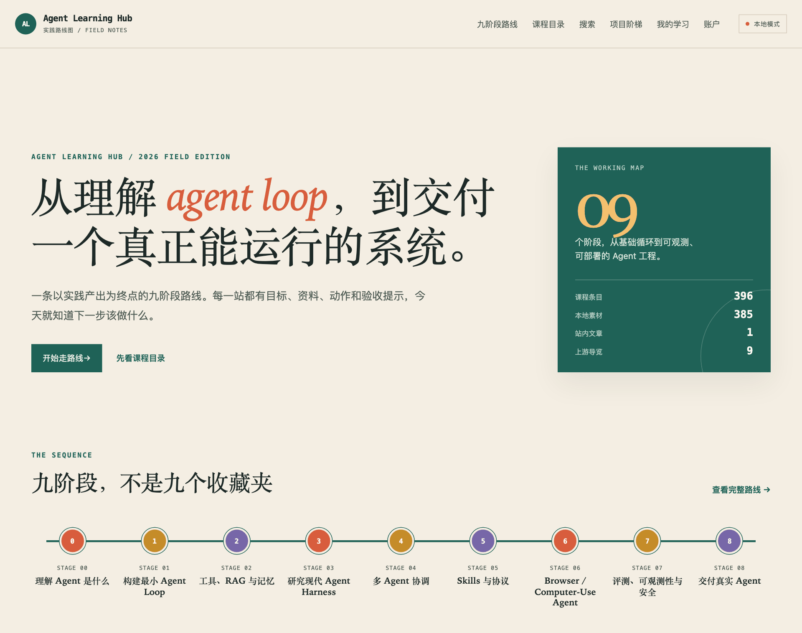

---

## 一、它是什么

学 Agent 工程时，资料往往散落在官方文档、工程博客、论文和开源仓库里。收藏越攒越多，却不知道先读哪篇、读到什么程度算学会、学完能拿出什么。

Agent Learning Hub 把这些资料整理成三样东西：

- **一条路线**：九个阶段，从"理解 Agent 是什么"一直走到"交付真实 Agent"。每一站都写明要理解什么、要动手做什么、最后交出什么。
- **一个资料库**：数百份精选资料，包括教材、源码解析、框架文档和工程实践，每份都标明作者、许可证和原始出处。
- **一本学习记录本**：进度、阅读位置、收藏、私人笔记和阶段成果都记在这里，下次打开就能接着学。

### 能帮你什么

| 你的困扰                 | 它怎么帮                                                           |
| ------------------------ | ------------------------------------------------------------------ |
| 不知道先学什么           | 路线告诉你这一站读什么、做什么，不用自己排课                       |
| 读完就忘，说不清学会没有 | 每一站以一份能给别人看的成果收尾：代码仓库、演示或学习总结         |
| 资料太长，读一半就断了   | 阅读器自动记住读到哪；多章资料有章节目录和上下章翻页               |
| 看过的内容找不回来       | 一个搜索框覆盖路线、资料和练习项目；本地模式还能搜到章节正文       |
| 担心学习记录外泄         | 笔记只有你自己能看到，也不进搜索；记录可以随时导出，也可以整个删除 |

### 适合谁

- 想从零系统入门 Agent 工程的开发者；
- 已经在用 Claude Code、Codex 等编程 Agent，想看懂它们内部怎么工作的人；
- 想亲手做出一个能运行的 Agent 项目、留下作品的人。

---

## 二、九个阶段，四条轨道

**阶段**是学习顺序。每一站都有 3 个实践动作和一份要交的成果：

| 阶段 | 主题                         | 这一站要交出的成果                               |
| ---- | ---------------------------- | ------------------------------------------------ |
| 00   | 理解 Agent 是什么            | 一页短笔记，解释你的场景为什么需要 Agent         |
| 01   | 构建最小 Agent Loop          | 一个能选择工具并返回最终答案的最小 Agent         |
| 02   | 工具、RAG 与记忆             | 一个资料研究助手                                 |
| 03   | 研究现代 Agent Harness       | 一个可调试的 harness demo                        |
| 04   | 多 Agent 协调                | 一个 research → write → review → revise 的小系统 |
| 05   | Skills 与协议                | 一个可复用的 skill pack                          |
| 06   | Browser / Computer-Use Agent | 一个从公开网页提取信息的 Agent                   |
| 07   | 评测、可观测性与安全         | 一份 Agent 评测表格和回归测试                    |
| 08   | 交付真实 Agent               | 一个别人 clone 下来就能运行的 Agent 项目         |

**轨道**是资料的主题分类，方便按兴趣找资料。同一份资料可以服务好几个阶段：

| 轨道        | 收录什么                                                               |
| ----------- | ---------------------------------------------------------------------- |
| Learning    | 从零建立 Agent 认知的主线教材：概念、范式、记忆、协议、评估            |
| AICoding    | Claude Code、Codex、OpenClaw、OpenCode 等编程 Agent 的源码、文档与生态 |
| Agentic     | 多 Agent 框架、记忆层，以及 Harness Engineering 的理论书与讲义         |
| Application | 把 Agent 装进产品：桌面客户端、供应商切换器、企业级开发框架            |

---

## 三、两种使用方式

同一个网站有两种模式，右上角的徽标随时告诉你当前在哪一种。

|            | 云端模式                               | 本地模式                                       |
| ---------- | -------------------------------------- | ---------------------------------------------- |
| 怎么用     | 浏览器打开公开站点                     | 在自己电脑上运行                               |
| 身份       | 用 GitHub 登录                         | 免登录，这台电脑的使用者就是你                 |
| 能读什么   | 本站文章；第三方资料只给出处和原始链接 | 以上全部，**再加**本机素材库里第三方资料的正文 |
| 学习记录   | 跟着你的 GitHub 账户走                 | 保存在这台电脑上                               |
| 右上角徽标 | 绿点 · 云端模式                        | 橙点 · 本地模式                                |

一句话：**想在站内直接读完整资料，用本地模式。** 云端公开站点目前还在上线准备中，现在使用请按下一节在本机运行。

---

## 四、开始使用

你需要：

- Node.js 22 或更新版本；
- 本项目的代码仓库；
- （可选）素材库 `local-courses/`，放在仓库根目录。没有它也能用，只是第三方资料会跳到原始网站阅读。

在仓库根目录执行：

```bash
npm ci --prefix code
```

```bash
npm run dev:local --prefix code
```

然后用浏览器打开 <http://127.0.0.1:3001>，看到右上角的**本地模式**就可以开始了。按 `Ctrl-C` 停止，学习记录不会丢。

> **地址只用 `127.0.0.1` 或 `localhost`。** 本地模式的免登录身份只认这两个地址；用局域网 IP 打开时，页面能显示，但学习记录读不出来、勾选也保存不了。

如果更习惯 Docker，一条命令即可完成构建、启动和健康检查，打开的地址相同：

```bash
code/scripts/local-preview.sh
```

素材库放在别处、换端口、在 Docker 里切换两种模式等更多方式，见 [快速上手](USER.md)。

---

## 五、第一次使用：推荐这样走

1. 首页点**开始走路线**。
2. 在路线页选当前阶段；不确定就从 Stage 00 开始。学过的阶段会显示进度。
3. 进入阶段页，先读"这一站要能说清楚"，再照"把理解变成动作"逐条去做，做完一条就在原处勾掉。
4. 需要资料时，点页面下方的**配套资料**，本地模式下直接在站内阅读。
5. 边读边在**我的学习**里记笔记。阅读位置自动保存，下次从"继续阅读"回来。
6. 做出成果后，在**我的学习 → 阶段成果**登记一个代码仓库、演示链接或学习总结。
7. 路线页这一站变成**已交成果**。确认自己真正掌握了，再点**确认阶段完成**，进入下一站。

> **完成要你自己确认。** 打开页面、点开链接都只算"开始"，勾完动作也不算完成。一个阶段只有在你交出成果之后才算走完，这是刻意的设计：学习的终点不是读完，而是留下一个别人能检查的东西。

---

## 六、页面说明

顶部导航依次是：九阶段路线、课程目录、搜索、项目阶梯、我的学习，以及最后一项（本地模式叫"账户"，云端模式叫"登录"）。

### 首页

首页做三件事：给出九阶段路线的入口，介绍四条轨道，并说明云端、本地两种模式的区别。右侧深绿色卡片是资料库的规模速览。第一次来直接点**开始走路线**。

### 九阶段路线

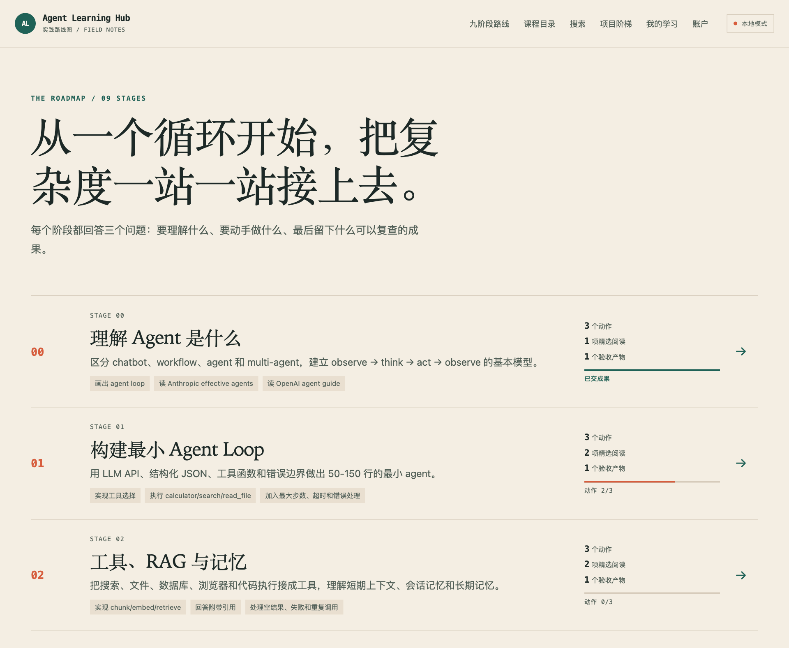

路线页一行一个阶段，每一行都写着这一站的目标、3 个实践动作，以及右侧的进度：

| 进度显示                | 含义                                               |
| ----------------------- | -------------------------------------------------- |
| `动作 2/3`              | 3 个实践动作里已经勾了 2 个                        |
| `动作已做完 · 待交成果` | 动作全部勾完，但还没登记成果，这一站**还没有完成** |
| `已交成果`              | 已在"我的学习"里登记了这一站的成果                 |

点任意一行进入阶段页：

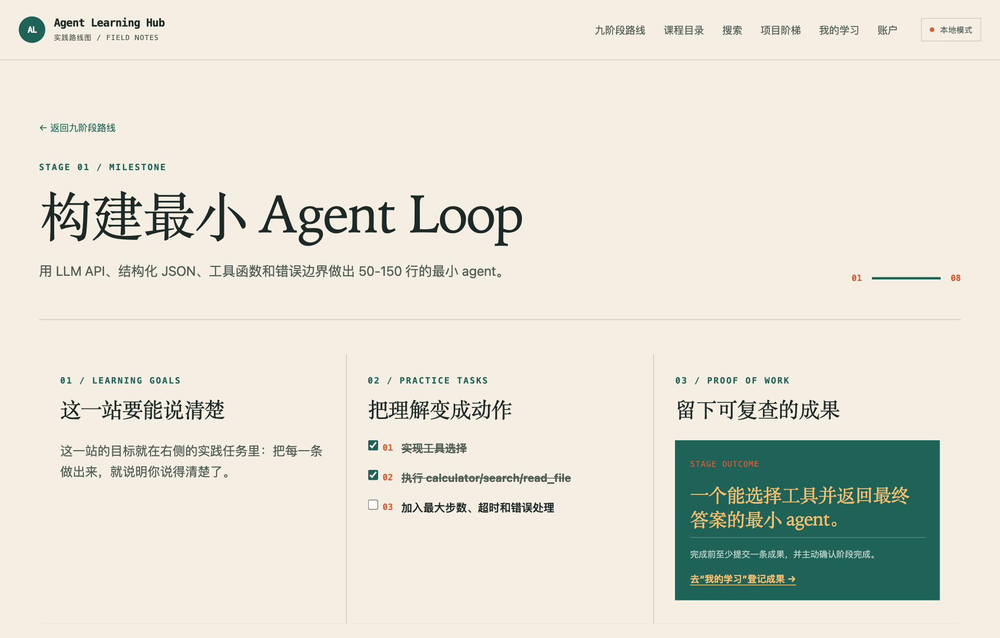

- **这一站要能说清楚**：学完应该能讲明白的事。
- **把理解变成动作**：编号的实践动作，直接在这里勾选，勾完立即保存并划掉。它和"我的学习"里的阶段任务是同一份记录，两边看到的状态一致。
- **留下可复查的成果**：这一站要交的东西。点**去"我的学习"登记成果**直接跳过去。

页面下方是这一站的**配套资料**，最底部可以切换到上一阶段或下一阶段。

> 云端模式未登录时，动作清单照常可读，但不显示勾选框和进度，登录后才能勾选。本地模式已自动签入，直接可用。

### 课程目录

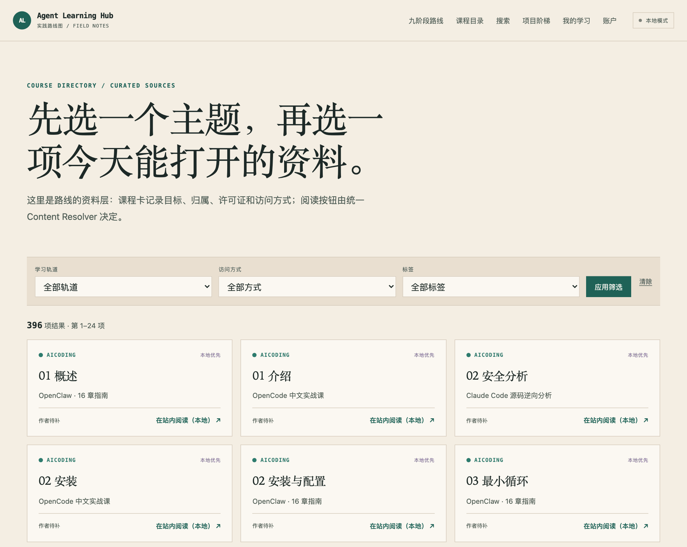

目录是资料库的全貌，每页 24 条，底部翻页。顶部可以按**学习轨道、访问方式、标签**筛选，选好后点"应用筛选"。筛选条件会写进网址，可以直接收藏或分享。

每张卡片右上角标出访问方式，右下角的按钮告诉你这一次点击会发生什么：

| 右上角标签 | 是什么                   | 右下角按钮                                                                     |
| ---------- | ------------------------ | ------------------------------------------------------------------------------ |
| 站内内容   | 本站自己写的文章         | 在站内阅读                                                                     |
| 本地优先   | 第三方资料，本机存有副本 | 本地模式下"在站内阅读（本地）"；云端模式下"打开上游"，没有原始地址时"暂不可用" |
| 上游链接   | 只提供原始地址           | 打开上游（新窗口）                                                             |
| 待处理     | 暂时没有可用的入口       | 暂不可用（鼠标悬停可以看到原因）                                               |

点卡片标题进入详情页：

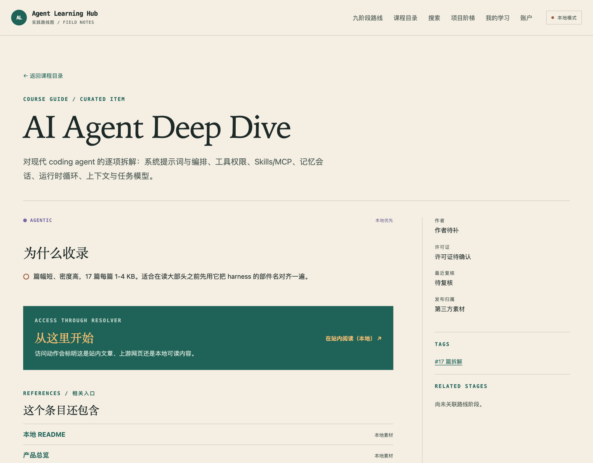

详情页写着这份资料**为什么被收录**、**从哪里开始读**，以及它包含的章节和相关入口。右栏是作者、许可证、最近复核时间、发布归属和它关联的路线阶段。

页面底部是你对这份资料的学习状态：

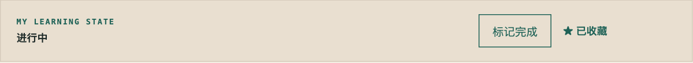

- **开始学习**：把它放进"继续阅读"；在阅读器里打开资料时会自动变成"进行中"。
- **标记完成**：你确认读完了，点一下；点错了可以撤销。
- **收藏**：稍后可在"我的学习 → 收藏"里找到。

### 阅读器

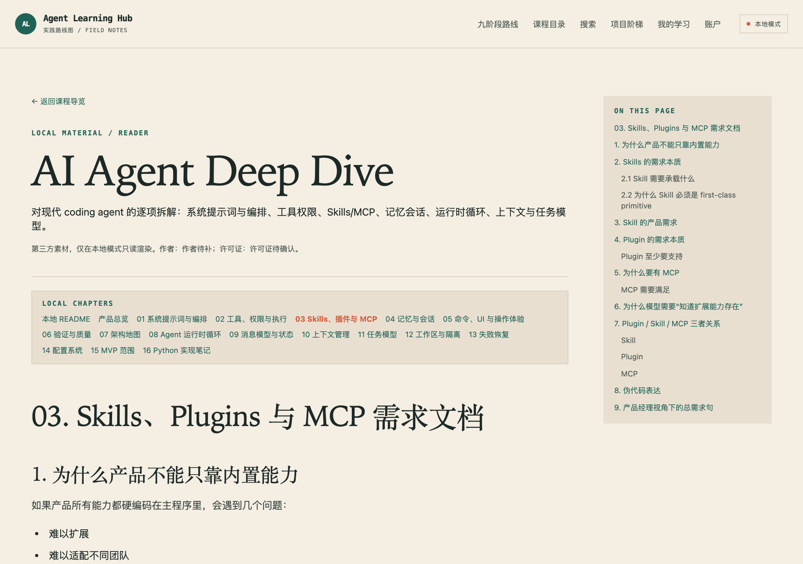

在站内阅读资料正文：

- 标题下方写明来源：第三方素材、作者和许可证。
- 多章资料在顶部有**章节切换条**，当前章节高亮；正文末尾有**上一章 / 下一章**。
- 右侧**本页目录**随页面滚动，点标题直接跳转。
- 读到哪里会自动保存，下次打开同一份资料会回到上次的位置。
- 资料缺失或暂时读不了时，页面会写明原因，并给出原始网站的入口，不会一片空白。

第三方资料里的排版（居中、表格、徽章图）会保留，脚本、表单等可能有风险的内容一律去掉，可以放心阅读。

### 搜索

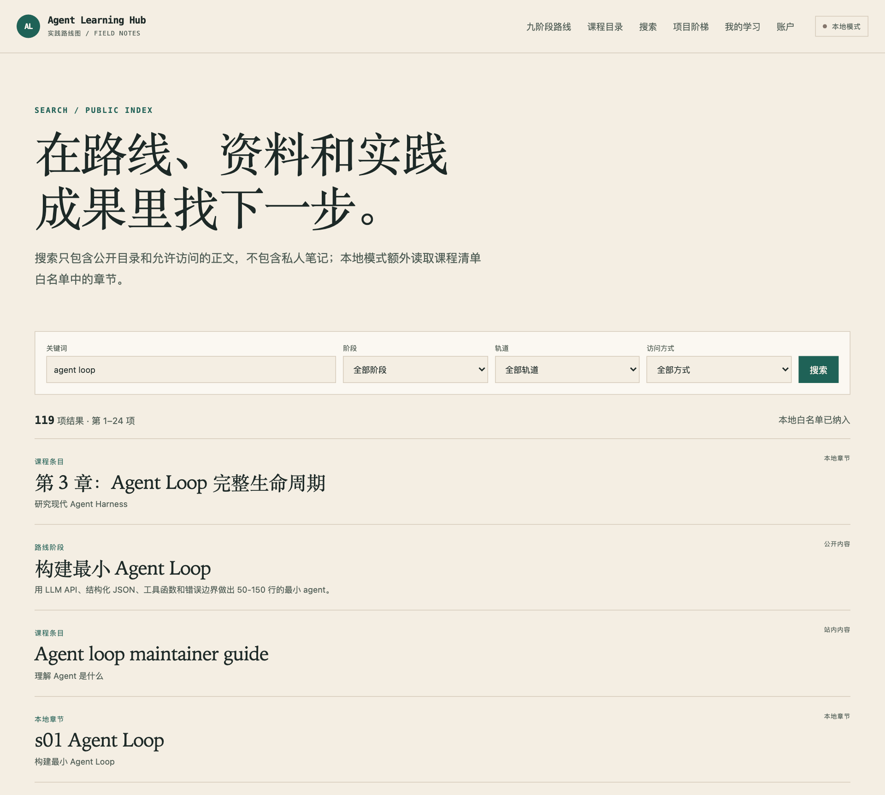

输入关键词后，可以再按阶段、轨道、访问方式组合过滤，结果同样分页。每条结果左上角标出它是什么（路线阶段、课程条目、本地章节或项目成果），标题下方是它所属的阶段或资料集合。

- 本地模式下，搜索还会覆盖资料里已开放阅读的章节正文。
- 只有一章的资料在结果里只出现一次；分成多章的资料才会额外列出各章，方便直接跳到某一章。
- **私人笔记永远不会出现在搜索结果里。**

### 项目阶梯

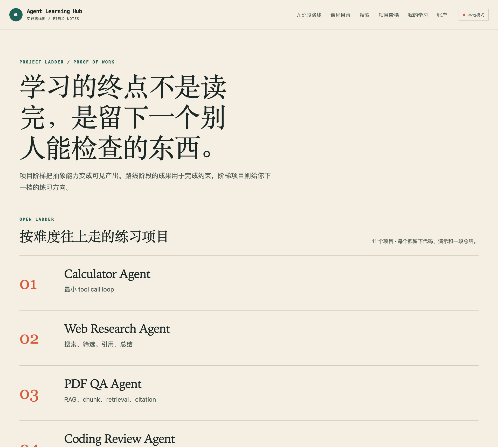

"学习的终点不是读完，而是留下一个别人能检查的东西。"这一页分两部分：

- **按难度往上走的练习项目**：11 个项目，从 Calculator Agent 到 Production Harness，与阶段无关，想练哪个练哪个。
- **九阶段各自要留下的成果**：每一站的验收要求，点"查看阶段要求"回到对应阶段页。

### 我的学习

你的私人区域。本地模式直接可用；云端模式需要先登录。

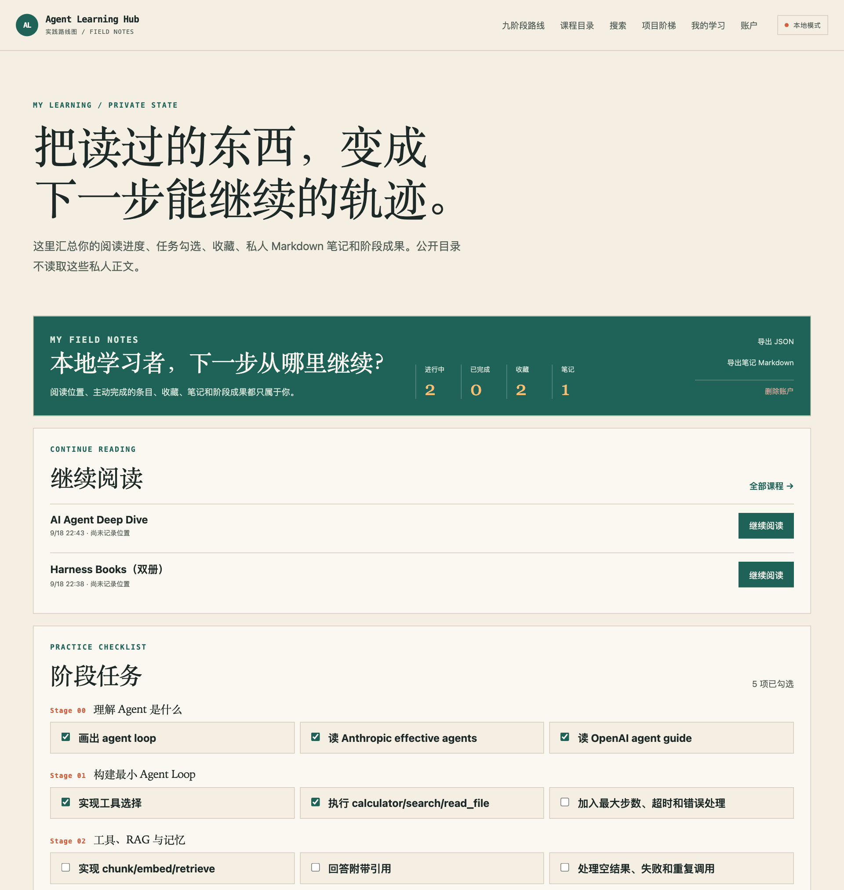

- **总览**：进行中、已完成、收藏、笔记四个数字，右侧是导出和删除账户。
- **继续阅读**：正在读的资料，点"继续阅读"回到上次的位置。
- **阶段任务**：九个阶段的全部实践动作，和阶段页勾的是同一份记录。

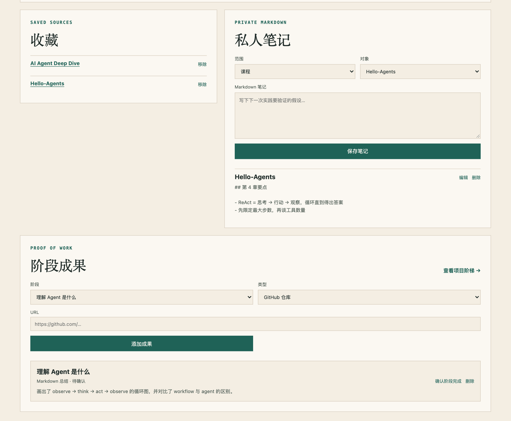

- **收藏**：在课程页点过"收藏"的资料，不想要了点"移除"。
- **私人笔记**：选择范围（某门课程或某个阶段）和对象，写下 Markdown 笔记后保存；已有笔记可以编辑或删除。
- **阶段成果**：选阶段和类型。"GitHub 仓库"和"演示链接"填网址，"Markdown 总结"直接写总结。添加后显示为"待确认"，你认为这一站真正完成时点**确认阶段完成**。**这里登记的成果，才是阶段完成的依据。**

### 账户 / 登录

- 本地模式：这一项叫"账户"，点进去只是说明本机身份已经自动准备好，不需要登录。
- 云端模式：这一项叫"登录"，使用 GitHub 账号登录。站点只申请识别身份所需的最小权限（`read:user`）。

---

## 七、你的数据

- **存在哪**：本地模式的学习记录保存在你这台电脑上；云端模式的记录跟着你的 GitHub 账户。
- **谁能看到**：进度、收藏、笔记和成果只属于你。公开的目录和搜索都不会读取这些私人内容。
- **导出**：在"我的学习"右上角，**导出 JSON** 得到全部学习记录，**导出笔记 Markdown** 只导出笔记。换电脑或清理前，建议先导出一份。
- **删除**："删除账户"会清除你的全部个人学习数据，**无法撤销**。它和导出按钮刻意分开摆放、用不同颜色，点击后还会再弹窗确认一次。
- **第三方资料**：资料库里的第三方内容版权归原作者。本地模式只在你的电脑上只读展示；云端只给出处和原始链接，不复制正文。详见站内的**内容政策**页面（页脚链接）。

---

## 八、常见问题

**卡片写着"本地优先"，点开却跳到了外部网站？**
你可能在云端模式，或者本机素材库里没有这份文件。切到本地模式（`npm run dev:local --prefix code`），并确认 `local-courses/` 放在仓库根目录。

**"我的学习"一直显示"正在读取"，勾选也没反应？**
检查浏览器地址是不是 `127.0.0.1` 或 `localhost`。用局域网 IP 打开时，页面能显示，但学习记录无法读写。

**作者显示"作者待补"，许可证显示"许可证待确认"？**
这是如实呈现：部分条目在收录时没有带齐这些信息，还在等待人工复核，并不是显示出错。

**为什么有些资料只能读到一两章，正文里有些链接只是普通文字？**
站内能读哪些章节，由维护者为每份资料逐一开放，这是保护本地素材的安全边界。还没开放的章节，正文里指向它们的链接会显示成普通文字，而不是一个点了会报错的死链。如果这份资料提供了原始地址，可以从课程详情页的"从这里开始"或相关入口打开原网站读全文。

**打开一个旧链接，却跳到了另一门课程的阅读器？**
同一份内容只保留一个入口。以前单独收录的章节，现在归到它所属的课程下，旧链接会自动跳到那门课程阅读器里对应的章节。

**目录有几百条，看不过来？**
不要从目录开始。从路线页开始，只读当前阶段的配套资料就够了。目录是用来查找的，不是阅读清单。

**能把本地素材发布到网上吗？**
不能。`local-courses/` 里是第三方资料，本机有副本不等于获得了公开发布的许可。云端站点不会打包、转发或索引这些内容。

**手机上找不到导航栏？**

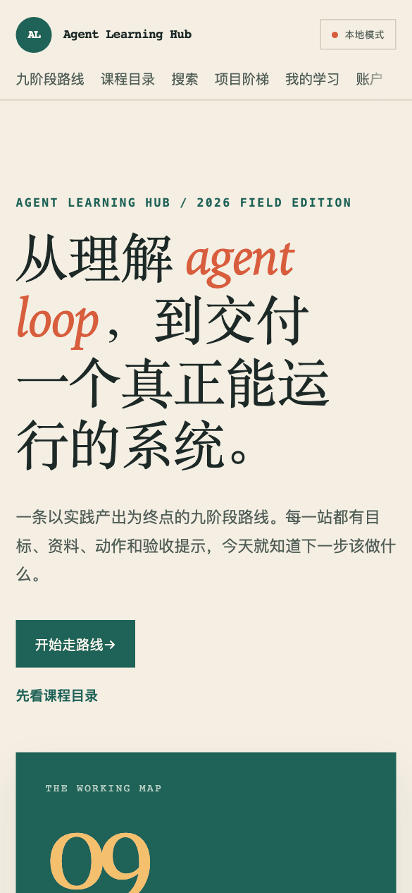

窄屏下，导航变成标题下方一条可以横向滑动的链接条。首页的九阶段路线条同样可以横滑。两处的右边缘都有淡出效果，提示右边还有内容。

**顶部导航最后一项为什么不是"登录"？**
本地模式已经自动为你签入，所以这一项叫"账户"。只有云端模式下它才是"登录"。

**换一台电脑，学习记录还在吗？**
本地模式的记录只保存在原来那台电脑上。需要留存时，在"我的学习"里导出 JSON。

---

## 给维护者

维护素材库（对账失效路径）、界面走查、功能回归、端到端测试和恢复演练，都在 [本机运行手册](docs/deploy/local-manual.md) 第 5、6 节；项目结构与全部命令见 [README](README.md)。
