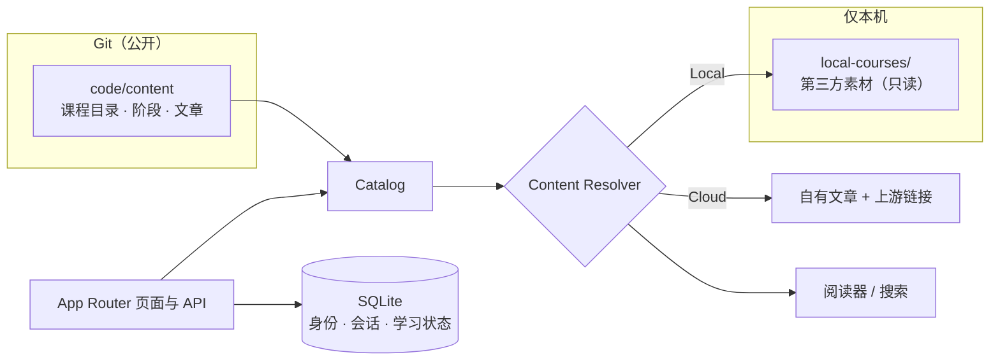

# Agent Learning Hub

以实践成果为主线的 Agent 工程学习网站：九阶段路线 × 四条学习轨道，公开学习与本地深读共用同一套站点。

Agent Learning Hub 把分散在官方文档、工程博客、论文和开源仓库里的 Agent 工程资料，整理成一条从"理解 Agent 是什么"到"交付真实 Agent"的路线。每个阶段都有学习目标、可验收的实践任务和配套阅读；阶段是否完成，以学习者自己提交的代码仓库、演示或学习总结为准，而不是勾选"已读"。

同一套代码有两种运行方式：

- **Cloud Mode**：公开站点，GitHub 登录。第三方资料只展示作者、许可证和上游地址，不复制正文。
- **Local Mode**：在自己电脑上运行，回环地址上免登录的单用户。可以直接在站内阅读本机 `local-courses/` 里的素材正文，缺失时回退到上游。

## 学习路线

| 阶段 | 主题                   | 阶段 | 主题                         |
| ---- | ---------------------- | ---- | ---------------------------- |
| 0    | 理解 Agent 是什么      | 5    | Skills 与协议                |
| 1    | 构建最小 Agent Loop    | 6    | Browser / Computer-Use Agent |
| 2    | 工具、RAG 与记忆       | 7    | 评测、可观测性与安全         |
| 3    | 研究现代 Agent Harness | 8    | 交付真实 Agent               |
| 4    | 多 Agent 协调          |      |                              |

资料按四条轨道归类，同一条资料可以服务多个阶段：

| 轨道            | 内容                                                                                 |
| --------------- | ------------------------------------------------------------------------------------ |
| **Learning**    | 从零建立 Agent 认知的主线教材：概念、范式、记忆、协议、评估，配套可运行代码          |
| **AICoding**    | Claude Code / Codex / OpenClaw / OpenCode 等真实 coding agent 的源码、文档与插件生态 |
| **Agentic**     | 多 Agent 框架、记忆层，以及 Harness Engineering 的理论书与讲义                       |
| **Application** | 把 Agent 装进产品：桌面客户端、供应商切换器、企业级开发框架                          |

阶段、任务和课程目录都是 Git 里人手维护的数据（`code/content/`），不是对素材目录的自动扫描。

## 功能

| 页面         | 能做什么                                                                               |
| ------------ | -------------------------------------------------------------------------------------- |
| `/roadmap`   | 九阶段路线；阶段页列出目标、实践任务和配套阅读，登录后显示个人进度并可就地勾选实践动作 |
| `/courses`   | 课程目录，按轨道、阶段、访问方式和标签筛选，分页浏览                                   |
| `/read/<id>` | 安全阅读器：Markdown 经 allowlist 消毒后渲染，多章课程带章节目录与上下章翻页           |
| `/search`    | 统一搜索阶段、课程与项目；Local Mode 下额外覆盖已声明章节的正文                        |
| `/projects`  | 项目阶梯：按难度递进的练习项目，以及九个阶段各自要留下的成果                           |
| `/learning`  | 我的学习：进度、阅读位置、收藏、私人笔记、阶段成果，支持导出数据与删除账户             |
| `/admin`     | 管理员健康摘要：内容审计、素材状态、数据库、加密备份、匿名运营指标和部署信息           |

两种模式的差别：

|            | Cloud Mode                      | Local Mode                              |
| ---------- | ------------------------------- | --------------------------------------- |
| 身份       | GitHub 登录                     | 回环地址上的固定单用户，免登录          |
| 第三方素材 | 只给出处与上游链接              | 只读渲染本机素材正文，缺失时回退上游    |
| 学习状态   | 服务端 SQLite，跟随账户         | 本机 SQLite，属于这台机器               |
| 部署形态   | 容器镜像，不含 `local-courses/` | 开发服务器或本机 Docker，只读挂载素材库 |

## 快速开始

需要 Node.js 22 或更新版本（CI 与 Docker 使用 Node.js 24）。

```bash
npm ci --prefix code
```

```bash
npm run dev:local --prefix code
```

打开 <http://127.0.0.1:3001>。只想看公开视角时改用 `npm run dev:cloud --prefix code`。开发服务只能通过 `127.0.0.1` 或 `localhost` 访问，素材目录默认是仓库根的 `local-courses/`，可用 `LOCAL_MATERIAL_ROOT` 改路径。

想要更接近真实部署的体验，用本机 Docker（构建镜像、启动 Local Mode 并做健康检查）：

```bash
code/scripts/local-preview.sh
```

更完整的上手步骤见 [USER.md](USER.md)，各页面怎么用见 [GUIDE.md](GUIDE.md)。

## 技术栈

- **应用**：Next.js 16（App Router）、React 19、TypeScript；所有页面按请求渲染，运行模式在运行时读取。
- **身份**：Cloud Mode 用 Better Auth + GitHub OAuth；Local Mode 在回环地址上自动签入固定单用户。
- **数据**：内容目录用 JSON + Zod schema 校验；身份、会话和学习状态存 SQLite（better-sqlite3），支持加密备份与恢复。
- **测试**：Vitest 与 Node test runner；HTTP 端到端测试；Playwright 驱动的版式走查与点击式功能回归。
- **交付**：Docker Compose（按 local / cloud / release 叠加覆盖文件）、GHCR 固定版本镜像、GitHub Actions 双模式质量门禁与带 SBOM 的发布流程。

## 架构



公开内容只在 Git 里，个人状态只在 SQLite 里，两者互不写入。内容访问上，Cloud/Local 只在 Content Resolver 分叉：同一个条目 ID 在两种模式下解析成不同的可访问结果（本地正文、自有文章或上游链接）。

领域逻辑位于 `code/modules/`，页面和路由只调用模块接口：

| 模块               | 职责                                               |
| ------------------ | -------------------------------------------------- |
| `catalog`          | 内容目录加载、schema 校验、查询与内容审计          |
| `content-resolver` | Cloud/Local 的内容解析边界与安全本地文件访问       |
| `reader`           | Markdown 消毒渲染、文档内链接解析与章节导航        |
| `search`           | 统一搜索索引（公开内容与已声明的本地章节）         |
| `auth`             | GitHub OAuth、本地单用户身份、请求鉴权与限流       |
| `learning-state`   | 进度、笔记、收藏、阶段成果、导出、删号与数据库备份 |
| `freshness`        | 素材与上游的新鲜度检查、目录漂移对账               |
| `observability`    | 不关联用户身份的匿名运营指标                       |
| `admin`            | 管理员健康摘要                                     |
| `runtime`          | 运行模式配置                                       |

## 仓库结构

```text
.
├── code/                 现役全栈工程（唯一的运行入口）
│   ├── app/              页面、API 路由与共享组件
│   ├── modules/          领域模块（见上表）
│   ├── lib/              页面侧的服务端取数入口
│   ├── content/          课程目录、阶段、轨道、项目成果与自有文章
│   ├── scripts/          质量门禁、素材维护、备份演练与部署脚本
│   ├── tests/            工具测试与端到端 HTTP 测试
│   ├── docker/           Dockerfile 与 Compose 配置
│   └── reports/          可再生成的审计与走查报告
├── docs/                 规格、架构、任务、ADR、部署 Runbook 与验收记录
├── local-courses/        本机第三方素材库（不进 Git、不进云端镜像）
├── learning-site/        旧站迁移基线（连同根目录 index.html、start-site.sh），不再演进
├── USER.md · GUIDE.md    本地快速上手 · 使用手册
└── AGENTS.md · CLAUDE.md 协作规则 · Claude Code 查阅索引
```

## 开发与验证

提交前运行双模式质量门禁，每条都依次执行格式检查、lint、类型检查、内容审计、测试和生产构建：

```bash
npm run check:cloud --prefix code
```

```bash
npm run check:local --prefix code
```

下列检查依赖运行中的服务、浏览器或仓库之外的素材库，因此不在 `check` 里，按需单独运行：

| 命令                                                  | 用途                                                             |
| ----------------------------------------------------- | ---------------------------------------------------------------- |
| `npm run audit:ui` / `audit:functional`               | 三档视口版式走查 / 点击式功能回归（需运行中的服务与 Playwright） |
| `npm run test:e2e:local` / `test:e2e:cloud`           | 端到端 HTTP 测试；**结尾会删号，只能指向一次性实例**             |
| `npm run materials -- <check\|drift\|audit\|reindex>` | 素材新鲜度、目录漂移、路径审计与重建索引                         |
| `npm run audit:boundaries`                            | 审计 Git、Docker 与 CI 的内容交付边界                            |
| `npm run drill:restore`                               | SQLite 备份恢复演练（含错误口令、篡改、覆盖三组反向对照）        |

以上命令都在 `code/` 下执行（或加 `--prefix code`）。测试分层见 [docs/testing-strategy.md](docs/testing-strategy.md)，走查、回归与恢复演练的具体用法见 [本机运行手册第 5 节](docs/deploy/local-manual.md#5-改完东西怎么自查)。

## 部署

Compose 文件位于 `code/docker/`，统一通过 `code/scripts/docker-deploy.sh <local|cloud|release> <action>` 管理：

- **本机对照两种模式**：`code/scripts/mode-switch.sh <local|cloud|both|status|stop>`，两种模式各用独立的 Compose 项目、端口和 SQLite 卷，只绑回环地址。
- **Cloud Mode**：从 `.env.example` 创建根目录 `.env`，填入 `BETTER_AUTH_SECRET`、`BETTER_AUTH_URL` 和 GitHub OAuth 凭据，先 `docker-deploy.sh cloud config` 静态检查再 `up`。
- **发布**：镜像只用固定版本或 digest，不用 `latest`。打 `v*.*.*` tag 触发 [release.yml](.github/workflows/release.yml) 构建并附带 SBOM 与签名溯源；`code/scripts/image-release.sh` 是手工推送路径。目标主机只拉取镜像，不重新构建源码。

生产部署从 [部署与运维入口](docs/deploy/README.md) 开始，其中有本机运行、完全手工上线和腾讯云 Lighthouse 脚本化部署三份 Runbook，以及全部脚本按运行位置的分类。

## 内容、数据与隐私

- **公开内容**（`code/content/`）由 Git 管理。第三方条目保留作者、许可证状态和上游地址；本地有副本不代表获得云端发布许可。
- **本地素材**（`local-courses/`）只在 Local Mode 下只读挂载，不进入 Git、云端构建上下文或云端索引。阅读器只打开条目显式声明的路径，拒绝路径穿越、符号链接逃逸和可执行 MDX。维护方式见 [local-courses/README.md](local-courses/README.md)。
- **个人状态**只存 SQLite（开发时在 `code/.data/`，容器里在命名卷），用户可随时导出或删除账户。运营指标只做匿名聚合，不记录用户 ID、IP、Cookie 或笔记正文。
- **报告**（`code/reports/`）可再生成，不进入运行时镜像。

交付边界由 `.gitignore`、`.dockerignore` 和 [docs/content-boundaries.json](docs/content-boundaries.json) 共同定义，`npm run audit:boundaries` 负责校验。

## 项目状态

截至 2026-08-28：

- **已完成**：Phase 0–6 全部任务；Phase 8 的功能对等、移动端与无障碍、全站走查与功能回归。双模式质量门禁、原生生产构建的端到端测试和正式本地 Docker 镜像验收均已通过，目标主机上的恢复演练已实跑通过。课程目录已按 [ADR 0008](docs/adr/0008-chapter-content-has-a-single-owner.md) 收敛为单一归属，当前 395 个在役条目。
- **待完成**：依赖仓库外部条件的上线验收——真实 GitHub OAuth、公网 DNS/TLS、GHCR 固定镜像拉取与回滚、受保护分支 CI、异地备份与定时调度、生产日志复核，以及切换入口并归档旧站（T8.5）。本地测试不能替代这些证据。

逐项状态、解除条件和证据见 [tasks.md 第 12 节](docs/plans/tasks.md#12-上线门槛核对表)，最近一次本地全量验收见 [docs/acceptance/local-e2e-2026-08-25.md](docs/acceptance/local-e2e-2026-08-25.md)。

## 文档

| 文档                                                 | 内容                                          |
| ---------------------------------------------------- | --------------------------------------------- |
| [USER.md](USER.md)                                   | 本地模式快速上手                              |
| [GUIDE.md](GUIDE.md)                                 | 使用手册：产品介绍、上手步骤与各页面用法      |
| [docs/plans/spec.md](docs/plans/spec.md)             | 产品规格与验收场景                            |
| [docs/plans/plan.md](docs/plans/plan.md)             | 架构、内容模型、部署与数据库运维              |
| [docs/plans/tasks.md](docs/plans/tasks.md)           | 实施任务、证据与需求追踪                      |
| [docs/deploy/](docs/deploy/README.md)                | 部署与运维入口、三份 Runbook、脚本分类        |
| [docs/testing-strategy.md](docs/testing-strategy.md) | 测试层次与质量门禁                            |
| [docs/adr/](docs/adr/)                               | 架构决策记录                                  |
| [docs/acceptance/](docs/acceptance/)                 | 历次验收报告                                  |
| [CONTEXT.md](CONTEXT.md)                             | 领域术语                                      |
| [AGENTS.md](AGENTS.md)                               | 在本仓库工作的规则与纪律（人和 Agent 都适用） |

## 许可证

本仓库代码与自有内容以 [MIT](LICENSE) 许可证发布。第三方资料的版权与许可证归原作者所有，本仓库不分发 `local-courses/` 中的内容。
