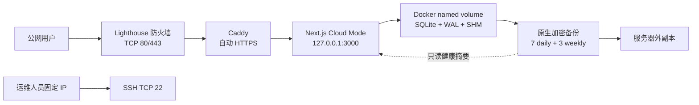

# 完全手工生产部署与运维

本文面向第一次接手项目的运维人员，从一台空白 Ubuntu 服务器开始，逐条完成 Cloud Mode 的固定镜像部署、HTTPS、GitHub OAuth、持久化、备份、升级、恢复和回滚。所有命令都从本仓库根目录或文中明确标出的服务器目录执行。

> 文档核对日期：2026-08-15。本文是可执行 Runbook，不是生产演练证据。完成 T7.3/T7.5 前，仍需在真实主机保存带日期、镜像 digest、备份 manifest、耗时和结果的验收记录。

## 0. 开始之前

### 0.1 这份文档在哪个位置

项目有三条运行路径，本文是第三条：

| 路径             | 文档                                                   | 什么时候用                           |
| ---------------- | ------------------------------------------------------ | ------------------------------------ |
| 本机运行         | [local-manual.md](./local-manual.md)                   | 学习、读素材、改代码                 |
| 云端**手工**部署 | **本文**                                               | 第一次上线，或需要理解每一步在做什么 |
| 云端**脚本**部署 | [lighthouse-automation.md](./lighthouse-automation.md) | 已经理解流程后的重复执行             |

本文与自动化文档做的是同一件事。**第一次上线建议先走本文**：脚本失败时你需要知道它卡在哪一步、那一步原本要做什么。两者的逐步对应关系见[第 16 节](#16-与自动化脚本的对应关系)。

### 0.2 时间预算

| 阶段                         | 一次性 / 重复      | 预计耗时   |
| ---------------------------- | ------------------ | ---------- |
| 第 2–4 节 控制面与 SSH       | 一次性             | 30–60 分钟 |
| 第 5–6 节 安装 Docker、Caddy | 一次性             | 15–30 分钟 |
| 第 7–8 节 配置与秘密         | 一次性             | 20–40 分钟 |
| 第 9–10 节 首次启动与 HTTPS  | 一次性             | 15–30 分钟 |
| 第 11 节 上线验收            | 每次发布           | 20–40 分钟 |
| 第 13 节 版本升级            | 每次发布           | 20–30 分钟 |
| 第 14.2 节 恢复演练          | 每月/每次改 schema | 30–60 分钟 |

DNS 生效和证书签发有外部等待，实际耗时可能更长。**不要在没有回滚窗口的时间点开始升级。**

### 0.3 前置检查清单

开始前逐项确认，任何一项为否就先补齐：

- [ ] 已在本机跑通站点，理解 Cloud Mode 与 Local Mode 的差别（[local-manual.md](./local-manual.md)）
- [ ] 已持有域名，且能修改其 DNS 记录
- [ ] 已有腾讯云账号，能创建 Lighthouse 实例并管理防火墙
- [ ] 已有 GitHub 账号，能创建 OAuth App
- [ ] 已有镜像仓库访问权限（GHCR 或自建），且目标版本镜像已发布
- [ ] 已准备好保存秘密的密码管理系统（`BETTER_AUTH_SECRET`、OAuth secret、`BACKUP_PASSPHRASE`）
- [ ] 已确定服务器**之外**的备份存放位置
- [ ] 本机 `ssh`、`curl`、`docker` 可用

### 0.4 本文涉及的脚本在哪里执行

本文大部分是手工命令，只有两个脚本参与，且它们运行在**服务器上**：

| 脚本                            | 执行位置 | 用途                                        |
| ------------------------------- | -------- | ------------------------------------------- |
| `code/scripts/docker-deploy.sh` | 服务器   | `release` 模式的 Compose 生命周期与健康检查 |
| `code/scripts/database.ts`      | 服务器   | 加密备份与恢复，在维护容器内执行            |

镜像构建与推送（`image-release.sh`）在**你自己的电脑上**执行，见[第 7 节](#7-获取与镜像匹配的部署配置)与 [USER.md 第 4 节](../../USER.md)。完整的脚本运行位置分类见 [docs/deploy/README.md](./README.md#脚本按运行位置分类)。

## 1. 目标拓扑和不变量



必须始终成立：

- 应用镜像来自 GHCR 固定版本标签或 digest，不使用 `latest`，也不在生产主机编译应用。
- `APP_BIND_HOST=127.0.0.1`；不得在 Lighthouse 或主机防火墙开放 `3000`。
- Cloud Mode 不上传或挂载 `local-courses/`。
- Caddy 是唯一公网入口；`BETTER_AUTH_URL` 与浏览器访问 origin 完全一致。
- SQLite 数据卷和备份目录不随 `docker compose down` 删除；不要使用 `down -v`。
- 系统盘快照、应用备份和异地副本用途不同，三者不能互相替代。

## 2. 上线前输入

准备下列值；示例值不能直接用于生产：

| 变量               | 示例                                         | 要求                                          |
| ------------------ | -------------------------------------------- | --------------------------------------------- |
| `ALH_DOMAIN`       | `learn.example.com`                          | 已持有的公开域名                              |
| `ALH_VERSION`      | `v0.1.0`                                     | 已发布 Git tag                                |
| `ALH_IMAGE`        | `ghcr.io/cr330326/agent-learning-hub:v0.1.0` | 固定标签，优先在首次拉取后改记 digest         |
| `ALH_PROJECT`      | `agent-learning-hub-production`              | 后续不得随意改变，否则会切换 Compose 资源集合 |
| `ALH_STATE_VOLUME` | `agent-learning-hub-production-state`        | 后续恢复时通过更换此值切换到新卷              |

当前 [release workflow](../../.github/workflows/release.yml) 没有声明多平台构建，因此生产实例按 `x86_64/amd64` 验收；不要假设现有发布镜像可运行在 ARM Lighthouse 上。

在本地终端设置非秘密变量：

```bash
export ALH_DOMAIN=learn.example.com
export ALH_VERSION=v0.1.0
export ALH_IMAGE=ghcr.io/cr330326/agent-learning-hub:v0.1.0
export ALH_PROJECT=agent-learning-hub-production
export ALH_STATE_VOLUME=agent-learning-hub-production-state
```

## 3. 腾讯云控制面准备

以下步骤在 Lighthouse 控制台完成，不能由仓库脚本替代。

1. 创建 `x86_64` Ubuntu 24.04 LTS 实例；Ubuntu 22.04 LTS 也在本文支持范围内。
2. 绑定 SSH 密钥。腾讯云说明 Ubuntu 默认用户是 `ubuntu`，绑定密钥后默认禁止 root 密码登录；优先保留这一安全默认值。参见[管理 SSH 密钥](https://cloud.tencent.com/document/product/1207/44573)。
3. 配置实例防火墙：

   | 来源                                          | 协议/端口  | 策略           |
   | --------------------------------------------- | ---------- | -------------- |
   | 运维人员当前公网 IP 或可信 CIDR               | TCP 22     | 允许           |
   | `0.0.0.0/0`（以及实际使用 IPv6 时的对应范围） | TCP 80,443 | 允许           |
   | 任意来源                                      | TCP 3000   | 不添加允许规则 |

   Lighthouse 防火墙只控制入流量，规则有优先级，腾讯云也建议遵循最小授权原则；修改前核对不会把当前 SSH 会话锁在外面。参见[管理实例防火墙](https://cloud.tencent.com/document/product/1207/44577/)。

4. 将 `ALH_DOMAIN` 的 DNS `A` 记录指向实例公网 IPv4；使用 IPv6 时同时配置正确的 `AAAA`。
5. 记录实例 ID、地域、公网 IP、SSH 主机密钥指纹和当前防火墙规则。
6. 在重大系统变更前创建 Lighthouse 系统盘快照。腾讯云提醒快照可能无法捕获尚未落盘的内存数据，且回滚整盘会清除快照时间点之后的数据，因此它不是 SQLite 一致性备份。参见[管理快照](https://cloud.tencent.com/document/product/1207/48546/)。

## 4. 配置并验证 SSH

在本机 `~/.ssh/config` 添加；`IdentityFile` 必须替换为本机私钥绝对路径：

```sshconfig
Host tencent-lighthouse
  HostName 203.0.113.10
  User ubuntu
  IdentityFile /absolute/path/to/tencent-lighthouse.pem
  IdentitiesOnly yes
  ServerAliveInterval 15
```

保护配置和私钥：

```bash
chmod 600 ~/.ssh/config /absolute/path/to/tencent-lighthouse.pem
```

首次连接前，从腾讯云控制台或另一可信通道核对主机指纹，不要在无法核对时盲目接受变化的指纹：

```bash
ssh tencent-lighthouse
uname -m
cat /etc/os-release
sudo -n true
exit
```

预期架构为 `x86_64`，系统为 Ubuntu 22.04/24.04，`sudo -n true` 成功。自动化脚本要求密钥登录和非交互 sudo；完全手工执行时可以在明确的交互会话中输入 sudo 密码。

## 5. 手工安装 Docker Engine 与 Compose

登录服务器：

```bash
ssh tencent-lighthouse
```

本地 shell 的变量不会自动传入 SSH 会话；在远端重新设置同一组非秘密值：

```bash
export ALH_DOMAIN=learn.example.com
export ALH_VERSION=v0.1.0
export ALH_IMAGE=ghcr.io/cr330326/agent-learning-hub:v0.1.0
export ALH_PROJECT=agent-learning-hub-production
export ALH_STATE_VOLUME=agent-learning-hub-production-state
```

先检查是否已有 Docker、Podman、`containerd` 或发行版 Compose 包。若是承载其他业务的既有主机，停止本 Runbook 并先做影响评估；以下步骤按专用空白服务器设计。

按照 [Docker 官方 Ubuntu 安装说明](https://docs.docker.com/engine/install/ubuntu/)添加官方 apt 仓库：

```bash
sudo apt-get update
sudo apt-get install -y ca-certificates curl
sudo install -m 0755 -d /etc/apt/keyrings
sudo curl -fsSL https://download.docker.com/linux/ubuntu/gpg \
  -o /etc/apt/keyrings/docker.asc
sudo chmod a+r /etc/apt/keyrings/docker.asc

sudo tee /etc/apt/sources.list.d/docker.sources >/dev/null <<EOF
Types: deb
URIs: https://download.docker.com/linux/ubuntu
Suites: $(. /etc/os-release && echo "${UBUNTU_CODENAME:-$VERSION_CODENAME}")
Components: stable
Architectures: $(dpkg --print-architecture)
Signed-By: /etc/apt/keyrings/docker.asc
EOF

sudo apt-get update
sudo apt-get install -y \
  docker-ce docker-ce-cli containerd.io docker-buildx-plugin docker-compose-plugin
sudo systemctl enable --now docker
sudo docker info
sudo docker compose version
```

不要为了省略 `sudo` 而未经评估把普通用户加入 `docker` 组；该组等价于主机 root 权限。

## 6. 手工安装 Caddy

使用 [Caddy 官方 Ubuntu/Debian 软件源](https://caddyserver.com/docs/install)：

```bash
sudo apt-get install -y \
  debian-keyring debian-archive-keyring apt-transport-https curl gnupg
curl -1sLf https://dl.cloudsmith.io/public/caddy/stable/gpg.key \
  | sudo gpg --dearmor -o /usr/share/keyrings/caddy-stable-archive-keyring.gpg
curl -1sLf https://dl.cloudsmith.io/public/caddy/stable/debian.deb.txt \
  | sudo tee /etc/apt/sources.list.d/caddy-stable.list >/dev/null
sudo chmod o+r \
  /usr/share/keyrings/caddy-stable-archive-keyring.gpg \
  /etc/apt/sources.list.d/caddy-stable.list
sudo apt-get update
sudo apt-get install -y caddy
sudo systemctl enable caddy
```

Caddy 获取公开证书需要域名解析正确且公网 `80/443` 可达；它会自动续期证书并把 HTTP 重定向到 HTTPS。参见 [Automatic HTTPS](https://caddyserver.com/docs/automatic-https)。

## 7. 获取与镜像匹配的部署配置

生产主机仍保留一份与发布 tag 匹配的仓库 checkout，用于 Compose 配置和数据库维护工具；应用本身只从 GHCR 拉取，不在主机构建：

```bash
sudo install -d -m 0755 -o ubuntu -g ubuntu /opt/agent-learning-hub
cd /opt/agent-learning-hub
git clone https://github.com/cr330326/Agent-Learning-Hub.git repository
cd repository
git fetch --tags --prune
git checkout --detach "$ALH_VERSION"
git status --short
```

预期 `git status --short` 为空。不要把 `local-courses/`、开发数据库、报告或本地 `.env` 从工作站复制到服务器。

若 GHCR 包不是公开可拉取的，使用只具有 `read:packages` 所需最小权限的 Token，通过标准输入登录，切勿把 Token 写进命令参数：

```bash
read -r -s -p 'GHCR token: ' ALH_GHCR_TOKEN
printf '\n'
printf '%s' "$ALH_GHCR_TOKEN" \
  | sudo docker login ghcr.io --username '<github-user>' --password-stdin
unset ALH_GHCR_TOKEN
```

## 8. 创建 GitHub OAuth App 与秘密文件

按 [GitHub 官方流程](https://docs.github.com/en/apps/oauth-apps/building-oauth-apps/creating-an-oauth-app)创建 OAuth App：

- Homepage URL：`https://${ALH_DOMAIN}`
- Authorization callback URL：`https://${ALH_DOMAIN}/api/auth/callback/github`
- 不注册已停用的 `/api/auth/github/callback`。

生成至少 32 字符的 Better Auth secret，并通过 `sudoedit` 写入文件；不要把生成结果放进共享终端日志：

```bash
openssl rand -base64 48
cd /opt/agent-learning-hub/repository
sudo install -m 0600 -o root -g root /dev/null .env
sudoedit .env
```

`.env` 内容：

```dotenv
BETTER_AUTH_SECRET=<long-random-secret>
BETTER_AUTH_URL=https://learn.example.com
GITHUB_CLIENT_ID=<oauth-client-id>
GITHUB_CLIENT_SECRET=<oauth-client-secret>
ADMIN_GITHUB_IDS=<comma-separated-stable-github-ids>

APP_IMAGE=ghcr.io/cr330326/agent-learning-hub:v0.1.0
APP_BIND_HOST=127.0.0.1
APP_PORT=3000
BACKUP_HOST_PATH=/var/backups/agent-learning-hub
BACKUP_OUTPUT_DIR=/data/backups
STATE_VOLUME_NAME=agent-learning-hub-production-state
```

再次检查：

```bash
sudo chmod 600 .env
sudo test "$(sudo stat -c '%a' .env)" = 600
```

为数据库备份单独创建 root-only 文件。应用容器不需要、也不应收到这个口令：

```bash
sudo install -d -m 0700 -o root -g root \
  /etc/agent-learning-hub /var/backups/agent-learning-hub
sudo install -m 0600 -o root -g root /dev/null \
  /etc/agent-learning-hub/backup.env
sudoedit /etc/agent-learning-hub/backup.env
```

内容只有一行，口令至少 12 字符并存入独立密码管理系统：

```dotenv
BACKUP_PASSPHRASE=<backup-only-passphrase>
```

## 9. 验证 Compose 并首次启动

直接使用 `config --quiet` 做静态验证，避免把展开后的 OAuth secret 输出到终端：

```bash
cd /opt/agent-learning-hub/repository
sudo docker compose \
  --env-file .env \
  --project-name "$ALH_PROJECT" \
  -f code/docker/docker-compose.yml \
  -f code/docker/docker-compose.cloud.yml \
  -f code/docker/docker-compose.release.yml \
  -f code/docker/docker-compose.production.yml \
  config --quiet
```

启动固定镜像。生产覆盖文件将备份目录只读挂载到应用，并使用 `.env` 中的稳定卷名：

```bash
sudo env \
  COMPOSE_PROJECT_NAME="$ALH_PROJECT" \
  COMPOSE_EXTRA_FILES=code/docker/docker-compose.production.yml \
  code/scripts/docker-deploy.sh release up
```

脚本会拉取镜像、等待容器健康并请求内部 `/api/health`。首次拉取后记录不可变 digest：

```bash
sudo docker image inspect "$ALH_IMAGE" \
  --format '{{index .RepoDigests 0}}'
```

后续可将 `.env` 的 `APP_IMAGE` 改为该 digest，以避免远端标签被意外移动。

## 10. 配置 HTTPS 反向代理

编辑 `/etc/caddy/Caddyfile`：

```bash
sudoedit /etc/caddy/Caddyfile
```

内容：

```caddyfile
learn.example.com {
  encode zstd gzip
  reverse_proxy 127.0.0.1:3000
}
```

替换域名后验证并加载：

```bash
sudo caddy validate --config /etc/caddy/Caddyfile --adapter caddyfile
sudo systemctl reload caddy
sudo systemctl --no-pager --full status caddy
```

本文未启用 Caddy access log，避免默认记录带查询参数的请求目标。需要集中日志时，只采集 Caddy 服务错误和应用输出的固定枚举运营日志，并继续遵守 [ADR-0005](../adr/0005-privacy-first-operational-metrics.md) 的最小化边界。

## 11. 上线验收

先验证主机内部：

```bash
curl --fail --silent --show-error \
  http://127.0.0.1:3000/api/health
sudo ss -lntp | grep -E ':(80|443|3000)[[:space:]]'
```

预期健康 JSON 包含 `"status":"ok"`、`"mode":"cloud"`，端口 `3000` 只监听 `127.0.0.1`。

再从服务器外验证：

```bash
curl --head "http://$ALH_DOMAIN/"
curl --fail --silent --show-error "https://$ALH_DOMAIN/api/health"
```

随后人工完成：

- 匿名访问首页、路线、课程、搜索和上游链接。
- GitHub OAuth 登录，确认 callback 正确、Cookie 仅在 HTTPS 下工作。
- 两个不同用户的数据隔离，以及跨会话恢复。
- 管理员 `/admin` 可见部署、数据库和备份摘要；普通用户收到 403，匿名用户收到 401。
- 云端搜索和页面不出现 Local Material 正文或本地阅读链接。

任何一项失败都不要删除旧镜像、旧卷或升级前备份。

## 12. 日常运维

### 12.1 状态、健康和日志

```bash
cd /opt/agent-learning-hub/repository
sudo env COMPOSE_PROJECT_NAME="$ALH_PROJECT" \
  COMPOSE_EXTRA_FILES=code/docker/docker-compose.production.yml \
  code/scripts/docker-deploy.sh release status
sudo env COMPOSE_PROJECT_NAME="$ALH_PROJECT" \
  COMPOSE_EXTRA_FILES=code/docker/docker-compose.production.yml \
  code/scripts/docker-deploy.sh release verify
sudo journalctl -u caddy --since '1 hour ago' --no-pager
sudo docker compose --project-name "$ALH_PROJECT" \
  -f code/docker/docker-compose.yml \
  -f code/docker/docker-compose.cloud.yml \
  -f code/docker/docker-compose.release.yml \
  -f code/docker/docker-compose.production.yml \
  logs --since 1h app
df -h /
sudo docker system df
```

不要把 `.env`、Cookie、OAuth 回调参数、私人笔记或完整错误请求复制到工单和验收报告。

### 12.2 创建原生一致性加密备份

生产应用可以保持运行。维护容器从 SQLite 只读连接调用 backup API，生成 AES-256-GCM 文件和 SHA-256 manifest；不要用 `cp` 复制运行中的主数据库。

```bash
cd /opt/agent-learning-hub/repository
export ALH_STATE_VOLUME=agent-learning-hub-production-state
export ALH_TOOL_CACHE=agent-learning-hub-production-maintenance-node-modules

sudo docker run --rm --pull=missing \
  --mount "type=bind,src=$PWD,dst=/workspace,readonly" \
  --mount "type=volume,src=$ALH_STATE_VOLUME,dst=/data/state,readonly" \
  --mount type=bind,src=/var/backups/agent-learning-hub,dst=/secure/backups \
  --mount "type=volume,src=$ALH_TOOL_CACHE,dst=/workspace/code/node_modules" \
  --env-file /etc/agent-learning-hub/backup.env \
  --env STATE_DATABASE_PATH=/data/state/learning-state.sqlite \
  --env BACKUP_OUTPUT_DIR=/secure/backups \
  --workdir /workspace \
  node:24.18.0-bookworm \
  bash -lc '
    set -Eeuo pipefail
    expected_hash=$(sha256sum code/package-lock.json | cut -d " " -f 1)
    installed_hash=$(cat code/node_modules/.agent-learning-lock 2>/dev/null || true)
    if [[ $installed_hash != "$expected_hash" ]]; then
      npm ci --prefix code
      printf "%s\n" "$expected_hash" > code/node_modules/.agent-learning-lock
    fi
    npm run db:backup --prefix code
  '
```

检查输出 JSON、加密文件和 manifest；命令会自动执行 7 个 daily/3 个 weekly 槽位保留。然后立即创建服务器外副本。以下示例在可信工作站上通过 SSH 下载已经加密的文件：

```bash
umask 077
ssh tencent-lighthouse \
  'sudo tar -C /var/backups/agent-learning-hub -czf - .' \
  > "agent-learning-hub-backups-$(date -u +%Y%m%dT%H%M%SZ).tar.gz"
```

下载后在另一存储介质验证归档可列出，再按组织策略复制到异地存储。服务器本地文件、Lighthouse 同机挂载盘或同实例系统盘快照都不算服务器外副本。

推荐节奏：

| 频率                     | 动作                                                                        |
| ------------------------ | --------------------------------------------------------------------------- |
| 每日                     | 原生加密备份、服务器外复制、健康检查、磁盘空间检查                          |
| 每周                     | 抽查最新 manifest 的大小与 SHA-256、检查 Caddy/Docker 安全更新              |
| 每月和每次 schema 变化后 | 在新卷执行恢复演练，记录版本、耗时、检查结果                                |
| 每次升级前               | 额外备份、服务器外复制、记录当前镜像 digest；重大变更再创建 Lighthouse 快照 |

## 13. 版本升级

1. 确认新 tag 的 CI 和 release workflow 已完成，镜像可拉取。
2. 执行第 12.2 节备份并完成服务器外复制。
3. 记录当前 `APP_IMAGE`、`STATE_VOLUME_NAME`、备份文件和 manifest。
4. 更新 checkout 与 `.env`：

   ```bash
   cd /opt/agent-learning-hub/repository
   git status --short
   git fetch --tags --prune
   git checkout --detach '<new-vX.Y.Z>'
   sudoedit .env
   ```

5. 重复第 9 节 `config --quiet` 和 `release up`。
6. 重复第 11 节全部验收，重点检查 OAuth、数据库 schema、管理员备份摘要和用户状态。
7. 观察稳定期结束前保留旧镜像、旧卷和升级前备份。

## 14. 应用回滚与数据库恢复

### 14.1 仅回滚应用镜像

只有确认旧应用可以读取当前 schema 时，才把 `.env` 的 `APP_IMAGE` 改回旧 tag/digest，并执行：

```bash
sudo env COMPOSE_PROJECT_NAME="$ALH_PROJECT" \
  COMPOSE_EXTRA_FILES=code/docker/docker-compose.production.yml \
  code/scripts/docker-deploy.sh release up
```

健康检查失败、未知 schema 兼容性或用户状态异常时，不要反复重启旧镜像，转入数据库恢复。

### 14.2 在新卷执行恢复演练

选择与目标应用版本兼容的备份，创建全新卷；恢复命令拒绝覆盖已有目标：

```bash
cd /opt/agent-learning-hub/repository
export ALH_BACKUP_FILE='<exact-backup-filename>.sqlite.enc'
export ALH_RECOVERY_VOLUME="agent-learning-hub-restore-$(date -u +%Y%m%dT%H%M%SZ)"
export ALH_TOOL_CACHE=agent-learning-hub-production-maintenance-node-modules

sudo docker volume create "$ALH_RECOVERY_VOLUME"
sudo docker run --rm --pull=missing \
  --mount "type=bind,src=$PWD,dst=/workspace,readonly" \
  --mount type=bind,src=/var/backups/agent-learning-hub,dst=/secure/backups \
  --mount "type=volume,src=$ALH_RECOVERY_VOLUME,dst=/data/restore" \
  --mount "type=volume,src=$ALH_TOOL_CACHE,dst=/workspace/code/node_modules" \
  --env-file /etc/agent-learning-hub/backup.env \
  --env ALH_BACKUP_FILE="$ALH_BACKUP_FILE" \
  --workdir /workspace \
  node:24.18.0-bookworm \
  bash -lc '
    set -Eeuo pipefail
    expected_hash=$(sha256sum code/package-lock.json | cut -d " " -f 1)
    installed_hash=$(cat code/node_modules/.agent-learning-lock 2>/dev/null || true)
    if [[ $installed_hash != "$expected_hash" ]]; then
      npm ci --prefix code
      printf "%s\n" "$expected_hash" > code/node_modules/.agent-learning-lock
    fi
    npm run db:restore --prefix code -- \
      --input "/secure/backups/$ALH_BACKUP_FILE" \
      --target /data/restore/learning-state.sqlite --yes
  '
```

用与备份相同的固定应用版本在独立回环端口验证：

```bash
sudo docker run --detach --rm \
  --name agent-learning-hub-restore-drill \
  --env-file .env \
  --env DEPLOYMENT_MODE=cloud \
  --env STATE_DATABASE_PATH=/data/state/learning-state.sqlite \
  --publish 127.0.0.1:3100:3000 \
  --mount "type=volume,src=$ALH_RECOVERY_VOLUME,dst=/data/state" \
  "$ALH_IMAGE"
curl --fail --silent http://127.0.0.1:3100/api/health
sudo docker stop agent-learning-hub-restore-drill
```

正式演练还要核对用户关联、进度、笔记、收藏、成果和 OAuth 会话边界，并记录 manifest 中的 `restoreVerifiedAt`。

### 14.3 将已验证的新卷切入生产

1. 再创建一份当前生产数据备份并完成异地复制。
2. 停止写入：

   ```bash
   sudo systemctl stop caddy
   sudo env COMPOSE_PROJECT_NAME="$ALH_PROJECT" \
     COMPOSE_EXTRA_FILES=code/docker/docker-compose.production.yml \
     code/scripts/docker-deploy.sh release down
   ```

3. 在 `.env` 中把 `STATE_VOLUME_NAME` 改为已验证的 `ALH_RECOVERY_VOLUME`，把 `APP_IMAGE` 改为创建该备份时的兼容版本。
4. 运行 `config --quiet`、`release up`、内部健康和数据抽查。
5. 数据正确后启动 Caddy并执行完整外部验收：

   ```bash
   sudo systemctl start caddy
   ```

6. 保留原生产卷，直到恢复验收和观察期结束；只有明确确认卷名且另有可恢复副本时才考虑删除。本文不提供自动删除命令。

## 15. 故障定位与停止条件

| 现象               | 先检查                                                    | 不要做                                     |
| ------------------ | --------------------------------------------------------- | ------------------------------------------ |
| SSH 不通           | Lighthouse 22 端口来源、密钥绑定、主机指纹、VNC 应急入口  | 不要向全网长期开放 22 或启用 root 密码登录 |
| HTTPS 证书失败     | DNS A/AAAA、80/443 防火墙、`journalctl -u caddy`          | 不要把应用 3000 直接暴露公网绕过 TLS       |
| `/api/health` 503  | 容器日志、内容目录、SQLite `quick_check`、卷权限          | 不要只复制或删除 `-wal`/`-shm` 文件        |
| OAuth 回调失败     | `BETTER_AUTH_URL`、GitHub callback、代理后的 HTTPS origin | 不要记录 client secret、授权码或 Cookie    |
| 升级后用户状态异常 | 停止写入、保留当前卷、选择升级前备份在新卷恢复            | 不要覆盖原卷或执行 `down -v`               |
| 磁盘接近满         | 备份保留、旧镜像、日志和系统空间                          | 不要在未核对卷名时运行全局 prune           |

出现以下任一情况立即停止上线：镜像不是固定版本、DNS/HTTPS 不稳定、3000 公网可达、备份未成功或未离机、OAuth secret 出现在日志、健康检查非 `ok/cloud`、无法解释将要使用或删除的卷名。

## 16. 与自动化脚本的对应关系

[`lighthouse-deploy.sh`](../../code/scripts/lighthouse-deploy.sh) 把本文中**可安全自动化的服务器动作**包成九个 action。下表是逐节映射——脚本报错时，用它定位失败卡在本文的哪一步，然后回到那一节手工排查。

| 本文章节                   | 脚本 action              | 自动化程度                                                             |
| -------------------------- | ------------------------ | ---------------------------------------------------------------------- |
| 第 3 节 腾讯云控制面       | —                        | **完全手工**。脚本不调用腾讯云 API                                     |
| 第 4 节 SSH 配置与验证     | `preflight`              | 只读检查 SSH、架构、OS、sudo、磁盘、Docker、Caddy                      |
| 第 5 节 安装 Docker        | `bootstrap`              | 全自动                                                                 |
| 第 6 节 安装 Caddy         | `bootstrap`              | 全自动                                                                 |
| 第 7 节 获取部署配置       | `deploy`（staging 阶段） | 从本机打包最小 bundle 上传，不在远端 clone 仓库                        |
| 第 8 节 OAuth 与秘密文件   | `configure`              | 上传 root-only 环境文件；**OAuth App 本身仍需手工创建**                |
| 第 9 节 首次启动           | `deploy`                 | 全自动，含健康等待                                                     |
| 第 10 节 HTTPS 反向代理    | `bootstrap` + `deploy`   | 写入 Caddyfile 并 reload                                               |
| 第 11 节 上线验收          | `verify`                 | 只覆盖内部健康 + 公网 HTTPS；**OAuth、多用户隔离、移动端仍需人工验收** |
| 第 12.1 节 状态与日志      | `status` / `logs`        | 全自动                                                                 |
| 第 12.2 节 加密备份        | `backup`                 | 全自动；**服务器外复制仍需手工**                                       |
| 第 13 节 版本升级          | `deploy`                 | 自动含升级前备份                                                       |
| 第 14.1 节 回滚应用镜像    | `rollback`               | 需 `LIGHTHOUSE_ROLLBACK_CONFIRMED=1`                                   |
| 第 14.2–14.3 节 数据库恢复 | —                        | **完全手工**。脚本明确不做数据恢复                                     |

三件事脚本永远不做，必须按本文手工完成：

1. **腾讯云控制面** — 实例、防火墙、DNS、快照。
2. **数据库恢复与切卷** — 第 14.2、14.3 节。`rollback` 只换镜像，不动数据。
3. **异地备份副本** — `backup` 只在服务器上生成加密文件。

准备好用脚本执行时，转到 [lighthouse-automation.md](./lighthouse-automation.md)。

## 17. 相关文档

- [local-manual.md](./local-manual.md) — 本机运行本地服务
- [lighthouse-automation.md](./lighthouse-automation.md) — 同一流程的脚本化版本
- [docs/deploy/README.md](./README.md) — 三条路径的选择与脚本运行位置分类
- [plan.md 第 13 节](../plans/plan.md#13-运行隐私备份与监控) — 运行、隐私、备份与监控的架构约定
- [spec.md 第 15 节](../plans/spec.md#15-部署规格) — 部署规格与验收要求
