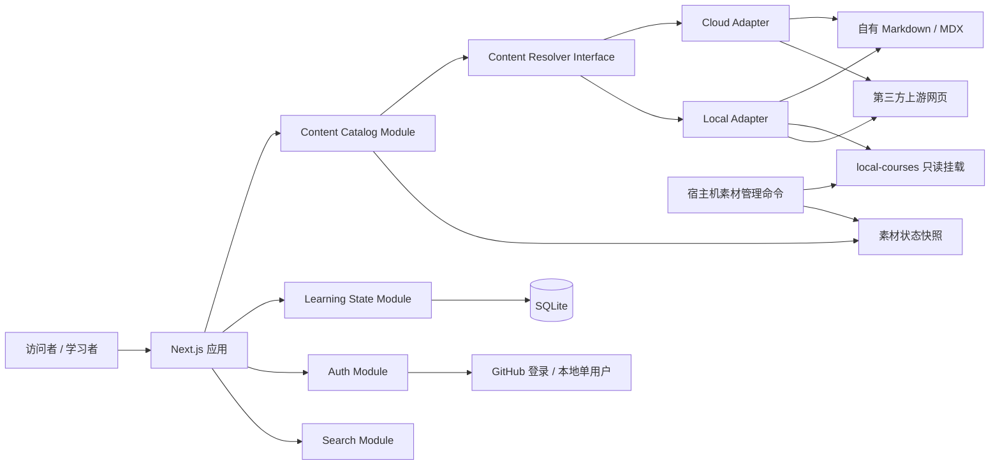

# Agent Learning Hub 产品与技术方案

**状态**：已确认，作为首版实施基线  
**确认日期**：2026-08-08  
**产品名称**：Agent Learning Hub / Agent 学习中心

## 1. 方案摘要

Agent Learning Hub 是一个以实践产出为主线的 Agent 工程学习平台。平台公开提供九阶段学习路线、课程导览、自有文章和项目阶梯；用户通过 GitHub 登录后，可以跨设备同步学习进度、收藏、私人笔记和阶段成果。

平台使用同一套应用支持两种运行模式：

- **云端模式**：不携带本地第三方素材库。自有 Markdown/MDX 在站内阅读，第三方资料通过经过策展的导览页访问上游网页。
- **本地模式**：通过 Docker 将 `local-courses/` 只读挂载进应用，优先使用站内阅读器；本地文件不存在时回退到上游网页。

公开课程内容由 Git 管理，用户身份和学习状态由部署服务器上的 SQLite 管理。第三方资料保留作者、许可证和上游地址，不作为本项目原创内容重新发布。

## 2. 当前仓库基线

以下数字是 2026-08-08 的本地快照，后续应由脚本生成，不能继续手工维护：

- `learning-site/` 已实现线路图式学习界面、课程目录、九阶段路线、进度记录和 Markdown/MDX 阅读器。
- 当前内容数据包含 4 条学习轨道、9 个阶段、42 个课程条目、38 个阅读分组和 472 篇阅读章节。
- 路径审计检查了 548 条本地引用，全部命中；`AICoding/opencode/code/openchamber` 尚未进入课程清单。
- `local-courses/` 约 11 GB、约 17.9 万个可见文件，包含 57 个嵌套 Git 仓库。
- 57 个嵌套仓库都有 `origin` 和上游分支；其中 3 个仓库存在本地追踪改动，不能自动拉取。
- 主仓库只追踪了少量 `local-courses/` 文件，直接部署当前仓库会导致云端阅读器无法访问绝大多数本地章节。
- 根目录旧版网站额外包含阶段笔记和深浅主题，可作为迁移参考，但不继续独立演进。

现有参考文件：

- [`README.md`](../../README.md)
- [`local-courses/README.md`](../../local-courses/README.md)
- [`learning-site/data.js`](../../learning-site/data.js)
- [`learning-site/app.js`](../../learning-site/app.js)
- [`learning-site/direction-approved.md`](../../learning-site/direction-approved.md)

## 3. 产品定位

### 3.1 目标用户

- 公开访问者可以浏览路线、课程导览、自有正文和项目建议。
- 任意 GitHub 用户可以登录并保存自己的学习状态。
- 仓库维护者拥有管理员身份，负责内容审核、素材状态和系统健康。
- 本地模式默认是仅限本机访问的单用户学习工作台，不要求联网登录。

### 3.2 核心价值

平台不是第三方资料镜像，也不是随机链接目录。它要完成三个目标：

1. 把 Agent 工程知识组织成一条可以执行的九阶段路线。
2. 让每个阶段产生代码、演示或总结等真实成果。
3. 在云端便捷访问上游资料，同时保留本地深度阅读大规模素材库的能力。

### 3.3 明确不做

首版不包括：

- AI 导师或自动问答。
- 评论社区、动态流和排行榜。
- 证书、积分、连续打卡奖励。
- 付费系统。
- 在线内容 CMS。
- 自动评分或 AI 审核阶段成果。
- 在云端抓取、代理或重新托管第三方正文。

## 4. 信息架构

### 4.1 九阶段主线

九阶段学习路线继续作为产品主结构，四条轨道只承担分类和筛选：

- Learning：系统课程与教材。
- AICoding：Coding Agent 与 Harness。
- Agentic：框架、记忆与理论。
- Application：落地应用与工具。

每个阶段统一包含：

- 学习目标。
- 维护者讲解。
- 精选学习资料。
- 实践任务。
- 明确的验收产物。
- 用户私人笔记。
- 完成状态。

普通任务可以逐项勾选，但阶段必须关联一个成果记录后才算完成。成果可以是 GitHub 仓库、演示链接或学习总结，由用户自证。

### 4.2 页面结构

公开页面：

- 首页。
- 九阶段学习路线。
- 课程目录与筛选。
- 课程导览页。
- 自有内容阅读器。
- 搜索结果。
- 项目阶梯。
- 关于、内容政策与贡献指南。

登录后页面：

- 我的学习面板。
- 继续阅读。
- 进度与收藏。
- 私人 Markdown 笔记。
- 阶段成果。
- 个人数据导出。
- 删除账户。

管理员页面：

- 内容审计结果。
- 上游素材新鲜度。
- 失效链接。
- 数据库、备份与部署健康。
- 不关联个人身份的访问汇总。

管理员不得浏览其他用户的私人笔记正文。

## 5. 总体架构



架构的关键 seam 是 `Content Resolver Interface`。云端和本地各有一个 adapter，调用者不需要理解文件挂载、上游链接、回退策略和安全校验。

## 6. 核心模块

### 6.1 Content Catalog Module

职责：读取、校验和查询所有公开课程、阶段和学习资料。

建议 Interface：

```ts
listItems(query): LearningItem[]
getItem(id): LearningItem
getStage(id): Stage
```

每个学习资料至少记录：

```yaml
id:
title:
track:
stageIds:
summary:
learningGoals:
sourceUrl:
localPath:
accessPolicy:
author:
license:
tags:
lastReviewedAt:
```

约束：

- `sourceUrl` 对第三方资料必填。
- `localPath` 可选，只用于本地模式。
- 缺少来源或许可证状态的第三方条目不能被标记为可重新发布。
- 数量统计必须从目录生成，不写入 README 常量。

### 6.2 Content Resolver Module

建议 Interface：

```ts
resolve(item, runtime): ResolvedContent
```

返回类型限制为：

- `internal-mdx`
- `local-document`
- `external-link`
- `unavailable`

Cloud Adapter：

- 自有 MDX 返回站内阅读地址。
- 第三方资料返回上游网页地址。
- 不读取或假设存在 `local-courses/`。

Local Adapter：

- 白名单文件存在时返回站内阅读地址。
- 文件不存在时回退上游网页。
- 路径必须解析在只读挂载根目录内，禁止路径穿越。

### 6.3 Learning State Module

职责：管理用户个人学习状态，包括：

- 未开始、进行中、已完成。
- 最近阅读位置。
- 阶段任务。
- 收藏。
- 私人 Markdown 笔记。
- 阶段成果记录。
- 数据导出与账户删除。

链接点击只能将外部资料标记为“已开始”。完成状态必须由用户手动确认，阅读位置不等于完成。

### 6.4 Auth Module

- 云端模式使用 GitHub 登录。
- 允许任意 GitHub 用户注册学习状态。
- 只申请身份识别所需的最低权限，不申请仓库写权限。
- 管理员通过稳定的 GitHub 用户 ID 白名单识别。
- 本地模式默认使用单用户身份，且服务只绑定 `127.0.0.1`。
- 本地服务主动开放到局域网或公网时必须启用登录。

### 6.5 Reader Module

保留现有阅读器的核心能力：

- Markdown、GFM 表格、代码块和图片。
- 目录、章节过滤、上下章。
- 阅读位置恢复。
- Markdown/MDX 的安全白名单渲染。

安全规则：

- 禁止脚本、事件属性、任意 iframe 和可执行 MDX JavaScript。
- 只允许经过定义的展示组件。
- 无法安全渲染的内容提供源码视图和上游网页链接。
- 云端不提供任意 URL 的服务器端抓取或代理。

### 6.6 Search Module

搜索只覆盖策展内容：

- 云端索引课程元数据、自有 MDX、阶段和项目内容。
- 本地模式额外索引课程清单中允许阅读的本地章节。
- 不扫描整个 `local-courses/`。
- 搜索结果明确标记站内、上游网页或本地可读。
- 本地素材更新后重建或增量更新索引。

### 6.7 Material Freshness Module

网站进程只读取素材状态，不直接修改 57 个嵌套仓库。

宿主机提供独立命令：

```text
materials check
materials update <course-id>
materials audit
materials reindex
```

更新流程：

1. 获取上游状态，但不修改工作区。
2. 比较本地和上游提交。
3. 标记最新、落后、分叉、本地修改或检查失败。
4. 用户选择单个仓库后，仅允许 fast-forward 更新。
5. 更新完成后执行路径审计并重建搜索索引。

当前存在本地追踪改动的仓库：

- `AICoding/claude/document/learn-claude-code`
- `AICoding/openclaw/openclaw-code`
- `AICoding/opencode/plugins/opencode-wakatime`

这些仓库必须拒绝自动更新，直到本地修改被明确处理。

## 7. 内容维护与归属

### 7.1 Git 管内容，数据库管状态

- 课程正文、路线、项目任务和公开文章位于仓库内的 Markdown/MDX 文件。
- frontmatter 记录阶段、轨道、来源、作者、许可证和更新时间。
- 内容通过 Git 提交、审查和发布。
- SQLite 只保存身份、会话和用户个人学习状态。
- 用户笔记默认私有，可以导出为 Markdown。
- 公开学习总结必须经过整理并提交到仓库，不允许直接公开私人笔记。

### 7.2 第三方内容策略

- `local-courses/` 是本地素材库，不是本项目原创内容目录。
- 云端不打包、不重新托管、不代理第三方正文。
- 云端课程页提供维护者摘要、学习目标、来源和上游链接。
- 只有许可证明确且确实需要站内发布的内容，才可进入单独白名单。
- 所有第三方条目保留原作者、上游地址和许可证信息。

### 7.3 社区贡献

- 用户通过 GitHub Issue 或 Pull Request 推荐和修正内容。
- 网站内不提供课程投稿表单。
- 公开内容必须经过维护者审核后进入 Git 历史。
- 贡献者和上游作者信息必须保留。

## 8. 数据模型

公开课程不存入 SQLite。建议用户数据表如下：

| 表 | 用途 |
| --- | --- |
| `user` / `account` / `session` | GitHub 身份和会话 |
| `item_progress` | 学习资料状态与阅读位置 |
| `stage_task_progress` | 阶段任务勾选 |
| `notes` | 私人 Markdown 笔记 |
| `bookmarks` | 收藏 |
| `stage_outcomes` | 阶段成果链接、总结和完成时间 |

数据约束：

- 所有个人记录按用户隔离。
- 笔记和请求频率设合理上限。
- 用户可以导出自己的进度、收藏、成果和笔记。
- 删除账户必须级联删除相关个人数据。

## 9. 双运行模式

### 9.1 云端模式

- `DEPLOYMENT_MODE=cloud`
- GitHub 登录。
- SQLite 位于持久化数据卷。
- 不挂载 `local-courses/`。
- 自有内容站内阅读，第三方资料打开上游网页。
- 通过反向代理提供 HTTPS。

### 9.2 本地模式

- `DEPLOYMENT_MODE=local`
- 默认单用户免登录。
- 只绑定 `127.0.0.1`。
- `local-courses/` 以只读方式挂载。
- SQLite 位于本机数据目录。
- 优先本地阅读，缺失时回退上游网页。
- 可以离线使用已经存在的本地资料。

两种模式使用同一镜像、同一课程 ID、同一内容 schema 和同一学习状态模型。

## 10. 技术选择

- Next.js App Router + TypeScript。
- Markdown/MDX 内容编译和经过白名单的渲染插件。
- Better Auth + GitHub 登录。
- SQLite + Node.js 稳定驱动。
- Docker 多阶段构建。
- Docker Compose 提供基础、云端和本地配置。
- GitHub Actions 执行校验、测试、镜像构建和版本发布。
- 云端部署固定版本标签，不直接跟随 `latest`。

运行 SQLite WAL 模式前，必须确认所使用的 SQLite 版本已经包含 2026 年 WAL-reset 问题修复。SQLite 文件、WAL 文件和共享内存文件必须位于同一台主机的持久化磁盘上。

## 11. 建议目录结构

```text
code/
  app/
  modules/
    auth/
    catalog/
    content-resolver/
    learning-state/
    reader/
    search/
    freshness/
  db/
content/
  stages/
  courses/
  articles/
  catalog/
  schemas/
deploy/
  compose.yaml
  compose.cloud.yaml
  compose.local.yaml
scripts/
  materials/
learning-site/
  ...迁移期间保持可运行
local-courses/
  ...本地素材库，不进入云端镜像
```

`code/` 是新前后端一体化工程的唯一代码目录。现有 `learning-site/` 和根 `index.html` 只作为迁移与功能对等基线保留；在 Phase 8 切换完成前不移动到 `code/`，也不继续作为独立产品演进。

## 12. 视觉与移动端

- 保留 `learning-site/` 已确认的交通线路图骨架和暖色出版物设计。
- 延续轨道色、阶段站点、课程网格和衬线阅读器。
- 增加登录状态、继续学习、部署模式和素材状态标识。
- 手机端支持完整的学习、搜索、阅读、笔记和进度流程。
- 手机端线路图改为可折叠阶段导航。
- 手机端阅读器使用目录抽屉和正文布局。
- 素材更新与部署管理只面向桌面或命令行。

## 13. 隐私、备份与监控

### 13.1 用户数据

- 只保存 GitHub 身份所需的最少字段。
- 不将 GitHub Token 用于身份登录之外的用途。
- 用户可以导出个人数据。
- 用户可以彻底删除账户及相关数据。
- 不接入广告型或跨站追踪。

### 13.2 SQLite 备份

- 每日生成一次一致性备份。
- 备份加密后复制到服务器之外。
- 保留最近 7 个每日备份和最近 3 个每周备份。
- 每次生产升级前额外生成快照。
- 定期在干净环境执行恢复演练。

### 13.3 监控

记录：

- 请求错误和登录失败。
- 数据库健康。
- 备份和恢复验证结果。
- 内容审计和素材更新结果。
- 不关联个人身份的页面访问汇总。

## 14. README 改写方案

### 14.1 根 README

根 README 应改为：

1. 项目名称和维护者身份。
2. 产品定位。
3. 云端与本地双运行模式。
4. 九阶段路线和功能截图。
5. Docker 快速启动。
6. 技术架构与内容策略。
7. 数据、隐私和备份说明。
8. 路线图与贡献指南。
9. 第三方内容归属声明。

必须删除原维护者信息。课程数量和章节数量由脚本生成，避免再次过时。

### 14.2 `local-courses/README.md`

该文件应改为“本地学习素材库说明”，包括：

1. 素材库用途和本地专属属性。
2. 明确“收录不等于原创或重新授权”。
3. 四条轨道及课程清单。
4. 每项资料的作者、许可证和上游链接。
5. 自动检查、选择性更新、路径审计和重新索引方法。
6. 云端不携带此目录的说明。
7. 存储占用和备份建议。

## 15. 实施阶段

### Phase 1：新应用骨架与内容 schema

- 创建独立 Next.js 应用。
- 建立测试、格式检查和类型检查。
- 定义课程、阶段和资料 schema。
- 编写 `data.js` 到新内容清单的转换器。

退出条件：现有课程和阶段能够无损转换，清单校验通过。

### Phase 2：公开网站与视觉迁移

- 迁移线路图、路线、课程网格和项目阶梯。
- 建立课程导览页和自有内容阅读器。
- 完成桌面和移动端基础布局。

退出条件：匿名用户可以完成路线浏览、课程查找和自有内容阅读。

### Phase 3：云端内容模式

- 实现 Cloud Adapter。
- 第三方资料通过上游网页访问。
- 验证云端构建不包含或依赖 `local-courses/`。

退出条件：删除本地素材库后，云端构建和所有公开页面仍可正常运行。

### Phase 4：身份与学习状态

- GitHub 登录。
- SQLite schema 和迁移。
- 进度、收藏、笔记、阶段成果。
- 数据导出和删除账户。

退出条件：登录用户可以跨会话恢复完整学习状态。

### Phase 5：本地 Docker 与阅读器

- 实现 Local Adapter。
- 只读挂载 `local-courses/`。
- 本地单用户模式。
- 安全阅读器和上游回退。

退出条件：本地 Docker 能覆盖现有阅读器核心功能，且不要求 GitHub 登录。

### Phase 6：搜索与素材新鲜度

- 策展内容搜索。
- 本地白名单章节索引。
- 素材检查、选择性更新、路径审计和重新索引。
- 管理员素材状态页面。

退出条件：能够发现上游变化，且不会自动修改存在本地改动的仓库。

### Phase 7：交付与运维

- GitHub Actions 测试和镜像发布。
- 云端与本地 Compose 配置。
- 版本化部署和回滚。
- SQLite 异地备份和恢复演练。
- 隐私优先监控。

退出条件：能够从空服务器部署指定版本，并从备份恢复用户数据。

### Phase 8：功能对等与切换

- 新旧站功能对照。
- 双模式端到端测试。
- 移动端验收。
- 切换仓库入口。
- 将旧站保留为迁移归档。

## 16. 首版上线门槛

- 云端模式不存在对 `local-courses/` 的隐式依赖。
- 本地 Docker 支持阅读、搜索和进度保存。
- 云端和本地使用同一课程 ID 与内容模型。
- GitHub 登录、笔记、收藏、导出和删除账户通过集成测试。
- 路径回退、路径穿越保护和恶意 Markdown 测试通过。
- 手机端完成一次学习、阅读、笔记和成果流程。
- SQLite 备份能够在干净环境恢复。
- 新站覆盖旧站核心阅读器能力。

## 17. 相关决策记录

- [ADR-0001：使用同一代码库支持云端与本地模式](../adr/0001-one-codebase-two-runtime-modes.md)
- [ADR-0002：第三方素材只作为来源引用，不进入云端内容包](../adr/0002-third-party-materials-are-references.md)
- [ADR-0003：采用自托管 Next.js 与单节点 SQLite](../adr/0003-self-hosted-nextjs-and-sqlite.md)

## 18. 下一步

实施从 Phase 1 开始：创建独立应用骨架、定义内容 schema，并编写 `learning-site/data.js` 转换器。现有 `learning-site/` 在功能对等验收前保持不变。

实施时使用以下拆解文档：

- [产品规格与验收标准](./spec.md)
- [分阶段实施任务清单](./tasks.md)
