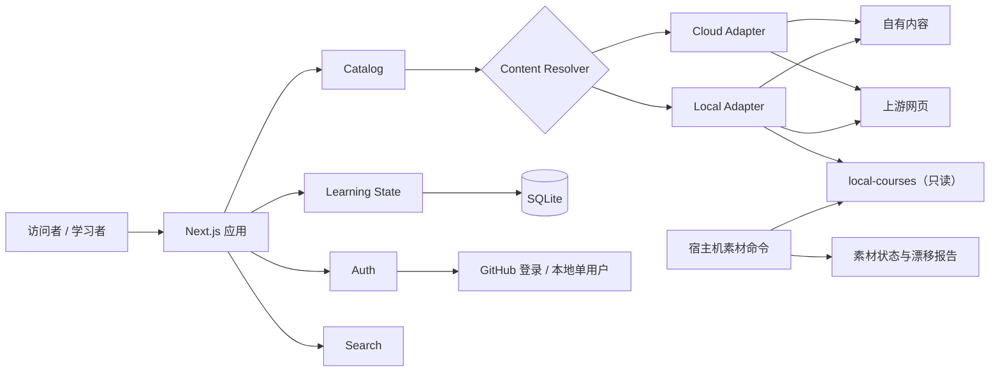

# Agent Learning Hub 产品与技术方案

**版本**：1.1（2026-09-18 按现役代码复核）
**配套**：[产品规格](./spec.md) · [任务与完成度](./tasks.md) · [架构决策](../adr/) · [部署与运维](../deploy/README.md)

本文描述架构、内容模型、归属和运行边界。需求 ID 与验收场景以 [spec.md](./spec.md) 为准，完成状态以 [tasks.md](./tasks.md) 为准，工作规则以 [AGENTS.md](../../AGENTS.md) 为准。

## 1. 方案摘要

Agent Learning Hub 是以实践产出为主线的 Agent 工程学习平台：公开提供九阶段学习路线、课程导览、自有文章和项目阶梯；学习者保存进度、收藏、私人笔记和阶段成果，阶段以自己提交的成果收尾。

同一套应用有两种运行模式：

- **云端模式**：不携带第三方素材库。自有内容站内阅读，第三方资料经导览页访问上游网页。GitHub 登录。
- **本地模式**：只读挂载 `local-courses/`，优先站内阅读，本地缺失时回退上游。回环地址上的固定单用户，免登录。

公开内容由 Git 管理，身份与学习状态由 SQLite 管理，两者互不写入。第三方资料保留作者、许可证和上游地址，不作为本项目原创内容重新发布。

## 2. 运行基线

**规模数字不写进本文。** 目录条目、章节、素材仓库和索引数量随内容与素材库变化，一律以命令生成的报告为准：

| 事实                 | 来源                                                                  |
| -------------------- | --------------------------------------------------------------------- |
| 目录规模与审计结果   | `npm run audit:content` → `code/reports/content-audit/`               |
| 素材新鲜度           | `npm run materials -- check` → `code/reports/materials/`              |
| 目录漂移             | `npm run audit:materials` → `code/reports/materials/catalog-drift.md` |
| 旧站迁移基线（历史） | `npm run audit:baseline` → `code/reports/baseline/`                   |

端口约定（以 `code/scripts/docker-deploy.sh` 与 `mode-switch.sh` 为准）：

| 场景                           | 地址             |
| ------------------------------ | ---------------- |
| 开发服务、本机 Docker Local    | `127.0.0.1:3001` |
| 本机 Docker Cloud              | `127.0.0.1:3002` |
| 发布 / 生产实例（反代之后）    | `127.0.0.1:3000` |
| 端到端测试的一次性实例（示例） | `127.0.0.1:3100` |

## 3. 产品定位

- **目标用户**：公开访问者浏览路线与导览；任意 GitHub 用户登录保存学习状态；维护者拥有管理员身份；本地模式是只在本机使用的单用户学习工作台。
- **核心价值**：把 Agent 工程知识组织成可执行的九阶段路线；让每个阶段产出代码、演示或总结；云端便捷访问上游，本地深读大规模素材库。
- **不做**：见 [spec §5.2](./spec.md#52-明确不做)。

## 4. 信息架构

### 4.1 九阶段主线与四条轨道

九阶段路线是产品主结构；Learning、AICoding、Agentic、Application 四条轨道只做分类和筛选（IA-001、IA-002）。每个阶段含学习目标、维护者讲解、精选资料、3 个实践任务、验收产物和完成状态。任务可逐项勾选，但阶段只有在关联成果并由用户确认后才算完成（STATE-005）。

### 4.2 页面

| 类别   | 页面                                                                                 |
| ------ | ------------------------------------------------------------------------------------ |
| 公开   | 首页、九阶段路线与阶段页、课程目录与导览、阅读器、搜索、项目阶梯、内容政策、贡献指南 |
| 需登录 | 我的学习：继续阅读、阶段任务、收藏、私人笔记、阶段成果、导出、删除账户               |
| 管理员 | `/admin`：内容审计、素材状态、数据库、加密备份、匿名运营指标、部署摘要               |

管理员判定要求云端模式且 GitHub ID 在 `ADMIN_GITHUB_IDS` 中，因此 `/admin` 在本地模式返回 404；本地运维改用 `/api/health` 和 `code/reports/` 下的审计产物。管理员不得浏览他人笔记正文。

### 4.3 展示层约定

以下约定对应 spec 的 PAGE 系列需求，具体实现规则见 AGENTS.md 第 4、5 节：

- **分页**（PAGE-009）：目录和搜索每页 24 条（`app/components/pagination.tsx`），只对当前页调用 Content Resolver，分页写入 URL。
- **中文标签**（PAGE-011）：schema 枚举经标签函数映射后渲染；导入遗留的 `Unknown` 与内部标签在展示层收敛，数据层保留原样以便人工复核。
- **参数校验**（PAGE-013）：筛选参数先对照目录真实值，不匹配视为未传，不回显。
- **状态快照**（PAGE-017~019）：`StageProgressProvider`（`app/components/stage-progress.tsx`）每页只取一次 `/api/state`；进度徽标最多显示"动作已做完 · 待交成果"，有成果记录才显示"已交成果"。
- **运行时渲染**：所有页面按请求渲染（`force-dynamic`），模式徽标和导航末项读取运行时 `DEPLOYMENT_MODE`。

## 5. 总体架构

关键 seam 是 Content Resolver：云端与本地各有一个 adapter，调用方不感知文件挂载、上游链接、回退和安全校验。领域逻辑位于 `code/modules/`，页面和路由只调用模块接口；模块职责表见 [README](../../README.md#架构)。

## 6. 核心模块

### 6.1 Catalog

- 读取、校验和查询 `code/content/` 下的轨道、阶段、阶段任务、项目成果、学习条目和自有文章；不读取 SQLite 或 `local-courses/`。
- 可执行契约是 `code/modules/catalog/content-schema.ts`（Zod）：先逐文件校验，再校验跨记录引用；发布归属、访问策略和本地路径的组合约束由 schema 强制（spec §7.2）。
- 接口：`listItems(query)` 按阶段、轨道、标签和访问策略筛选并按稳定 ID 排序；`getItem(id)` / `getStage(id)` 找不到时返回 `undefined`。
- **单一归属**（ADR 0008）：一份本地正文只属于一个未退场条目；退场条目携带 `redirect`，被目录、搜索、计数和学习面板排除，`/courses/<id>` 与 `/read/<id>` 把旧 ID 转发到拥有者。重复归属、无效或自指的 redirect、阶段引用退场条目，都在加载时失败。
- **人手维护**（ADR 0006）：`courses.json` 与 `stages.json` 是权威事实源。旧站转换器 `convert:legacy` 已废弃，仅作溯源保留。

### 6.2 Content Resolver

`resolve(item)` 返回 `internal-mdx` / `local-document` / `external-link` / `unavailable` 之一并附动作文案（spec §8.1）。

- Cloud Adapter：自有内容站内阅读；第三方资料有上游地址则打开上游，否则不可用；从不读取本地路径。
- Local Adapter：白名单文件存在时站内阅读；缺失时回退上游，无上游则返回原因；路径必须落在只读挂载根内，拒绝穿越与符号链接逃逸。

### 6.3 Learning State

管理条目状态（未开始 / 进行中 / 已完成）、阅读位置、阶段任务、收藏、私人笔记、阶段成果、导出与删号。打开或点击只标记"进行中"；完成必须由用户确认，阅读位置不等于完成。写接口统一做 CSRF 校验并按用户限流。

### 6.4 Auth

- 云端：Better Auth + GitHub OAuth，只申请 `read:user`，稳定用户 ID 为 `github-<id>`；不保存 provider token，会话 token 只存哈希（ADR 0004）。
- 管理员：按 GitHub 稳定 ID 白名单识别。
- 本地：固定单用户，只接受回环绑定；配置为非回环地址时拒绝免登录启动。

### 6.5 Reader

- **渲染策略**（`modules/reader/markdown.ts`）：第三方素材为 GitHub 而写，普遍混用排版 HTML，因此采用"标签/属性白名单放行"而非全量转义。`script`、`style`、`iframe`、表单等整棵丢弃；未知标签丢标记留文本；`on*` 属性一律丢弃；`href` 只接受 `http(s)`、`mailto`、站内路径和锚点；未闭合标签补齐；有效字符实体原样输出。
- **路径解析**：链接和图片先经 `resolveDocumentRelativePath()` 按当前文档目录解析，再对照条目声明的路径。命中章节的链接改写为 `/read/<id>?chapter=<path>`，否则降级为纯文本；命中声明的图片走 `/api/local-image`，否则整张丢弃。两处白名单必须一起改。
- **图片属性**：所有 `` 带 `loading="lazy"`、`decoding="async"`、`referrerpolicy="no-referrer"`。彻底禁止远程图片属于内容政策变更，需单独 ADR。
- **章节**：允许阅读的章节由条目声明；`listLocalChapters()` 同时决定章节列表和上下章顺序。不对工具仓库、文档站类素材做全量章节声明，以免噪音污染阅读器与索引。
- **退化**：无法安全渲染的文本提供纯源码视图和上游链接；二进制或过大文件不转成 HTML。
- 扩大任何白名单都属于安全边界变更，需先更新 ADR 与规格。

### 6.6 Search

- 只覆盖策展内容：云端索引阶段、条目元数据、自有正文和项目；本地额外索引条目声明的章节，不扫描整个素材库。私人笔记永不进索引。
- **一个目标一条结果**（SEARCH-008）：`buildRuntimeSearchIndex()` 把单章条目的正文并入条目本身，多章条目另外产出逐章结果；退场条目整体跳过。数据层的单一归属保证同一正文不会被两次索引。
- 结果定位信息取 `SearchDocument.summary`：条目用摘要，阶段用阶段摘要，章节用所属条目标题。

### 6.7 素材维护

网站进程只读素材状态，从不修改嵌套仓库。宿主机命令（`code/scripts/materials.ts`）：

| 命令                          | 作用                                                                           |
| ----------------------------- | ------------------------------------------------------------------------------ |
| `materials check`             | 比较本地与上游：最新、落后、分叉、本地修改、检查失败；不修改工作区             |
| `materials update <id> --yes` | 单课程、clean working tree、只 fast-forward；成功后审计并重建索引              |
| `materials audit` / `reindex` | 路径审计；重建不含正文的索引快照                                               |
| `materials drift`             | 目录漂移对账：失效路径与候选、未收录仓库、缺少上游回退；`--apply` 只落印证搬迁 |

新鲜度（本地 vs 上游）与漂移（目录 vs 磁盘）是两件事（ADR 0007）。漂移按设计非零退出，不进入 `npm run check`；审计中 `local-path-missing` 是 warning，路径逃逸和非文件仍是 error。

## 7. 内容维护与归属

### 7.1 Git 管内容，数据库管状态

- 课程目录、阶段、项目任务和公开文章位于 `code/content/`，通过 Git 提交、审查和发布。
- SQLite 只保存身份、会话和个人学习状态。笔记默认私有、可导出；公开的学习总结必须整理后提交到仓库。

交付边界由 [docs/content-boundaries.json](../content-boundaries.json) 定义，`npm run audit:boundaries` 在 CI 中校验：

| 区域                                     | 归属                                                     |
| ---------------------------------------- | -------------------------------------------------------- |
| `code/`（含 `code/content/`）            | 应用源码与可公开的策展内容，进入运行镜像                 |
| `docs/`、`learning-site/`                | 文档与迁移基线，不进镜像                                 |
| `local-courses/`                         | 第三方素材；只允许跟踪其 `README.md`，仅本地模式只读挂载 |
| `code/.data/`、`backups/`、`.env*`、密钥 | 运行状态或秘密，不进 Git、构建上下文或镜像               |
| `code/reports/`                          | 可再生成的审计证据，不进镜像                             |

### 7.2 第三方内容与贡献

- 云端不打包、不重新托管、不代理第三方正文；课程页提供摘要、学习目标、来源和上游链接。
- 只有许可证明确且确需站内发布的内容，才可标记为可发布。
- 内容推荐与修正通过 GitHub Issue / Pull Request，经维护者审核后进入 Git；站内不提供投稿表单。

## 8. 数据模型

公开课程不进 SQLite。个人数据表见 [spec §10.2](./spec.md#102-数据表边界)，约束如下：

- 所有个人记录按用户隔离；笔记与成果总结上限 20,000 字符，写请求限流。
- 删除账户级联删除全部个人数据。
- `operational_metrics` 只存固定枚举的事件、范围、结果、计数和最后发生时间，按小时聚合，30 天后清理（ADR 0005）。

## 9. 双运行模式

|                   | 云端模式                 | 本地模式                           |
| ----------------- | ------------------------ | ---------------------------------- |
| `DEPLOYMENT_MODE` | `cloud`                  | `local`                            |
| 身份              | GitHub 登录              | 固定单用户，免登录                 |
| 绑定              | 反向代理 + HTTPS         | 只绑定 `127.0.0.1`                 |
| 素材库            | 不挂载                   | 只读挂载 `local-courses/`          |
| 阅读              | 自有内容站内，第三方上游 | 优先本地，缺失回退上游；可离线阅读 |
| SQLite            | 服务器持久化卷           | 本机数据目录或 Docker 命名卷       |

两种模式使用同一镜像、同一课程 ID、同一内容 schema 和同一学习状态模型。

**开发服务的回环约束**：本地免登录身份由 `assertLocalAuthBinding` 强制，非回环绑定直接拒绝启动。`next dev` 会按 `allowedDevOrigins` 拒绝未列入来源的静态资源，页面因此无法完成客户端加载（"我的学习"停在加载态）。`code/next.config.ts` 必须列入 `127.0.0.1`、`localhost`、`[::1]`（NFR-009）。生产的 `next start` 不做这项校验，所以这类问题只能靠界面走查发现。

## 10. 技术选择

- Next.js 16 App Router、React 19、TypeScript；自研白名单 Markdown 渲染器。
- Better Auth + GitHub OAuth；SQLite（better-sqlite3），WAL 仅在 SQLite ≥ 3.51.3 时启用。
- Zod 内容 schema；Vitest 与 Node test runner；Playwright 驱动的走查脚本（不写入依赖）。
- Docker 多阶段构建；Compose 基础文件加 cloud / local / release / production 覆盖。
- GitHub Actions：双模式质量门禁、按模式的端到端测试、cloud clean-room 镜像扫描；`v*.*.*` tag 触发带 SBOM 与签名溯源的发布。

## 11. 视觉与移动端

- 沿用旧站确认的交通线路图骨架与暖色出版物风格：轨道色、阶段站点、课程网格、衬线阅读器。
- 页头显示运行模式徽标；窄屏（860px 以下）主导航让位给可横向滚动的导航条，右边缘淡出提示还有内容；首页九阶段路线条同样横向滚动。
- 窄屏阅读器把本页目录置于正文之前，正文占满宽度。
- 手机端支持完整的学习、搜索、阅读、笔记和成果流程；素材更新与部署管理只面向命令行。

## 12. 质量与验证策略

测试分层和命名约定见 [docs/testing-strategy.md](../testing-strategy.md)。各层证据相互独立，不能用一层的通过替代另一层：

| 层级           | 命令                               | 覆盖                                                         | 是否在 `check` 中 |
| -------------- | ---------------------------------- | ------------------------------------------------------------ | ----------------- |
| 代码级门禁     | `check:cloud`、`check:local`       | 格式、lint、类型、内容审计、单元与工具测试、生产构建         | 是                |
| 端到端（HTTP） | `test:e2e:cloud`、`test:e2e:local` | 云端真实登录、鉴权、CSRF、状态、导出、删号；本地状态生命周期 | 否（CI 按模式跑） |
| 界面走查       | `audit:ui`                         | 三档视口截图；HTTP 错误、横向溢出、页面高度、控制台报错      | 否                |
| 功能回归       | `audit:functional`                 | 真实点击：链接、翻页、筛选、章节、学习状态往返               | 否                |
| 素材与边界     | `materials …`、`audit:boundaries`  | 新鲜度、漂移、路径审计、交付边界                             | 否（边界在 CI）   |
| 恢复演练       | `drill:restore`                    | 备份→全新目录恢复→逐表比对，含三组反向对照                   | 否                |
| 外部环境       | 部署 Runbook                       | 真实 OAuth、DNS/TLS、镜像拉取与回滚、异地备份                | 否                |

端到端测试以删号收尾，只能指向带独立 `STATE_DATABASE_PATH` 的一次性实例。

## 13. 运行、隐私、备份与监控

### 13.1 用户数据

只保存 GitHub 身份所需的最少字段；Token 不用于登录之外的用途；用户可导出个人数据、彻底删除账户；不接入广告型或跨站追踪。

### 13.2 SQLite 备份与恢复

- **迁移**：`modules/learning-state/database.ts` 以事务逐版本应用 schema，失败回滚、下次启动重试；每个连接启用外键，个人表从 `users` 级联删除。
- **状态单元**：数据库、`-wal`、`-shm` 是一个整体，不得在运行中只复制主文件。只读打开时 `-wal` 非空而 `-shm` 缺失会直接 `SQLITE_CANTOPEN`。
- **备份**：`npm run db:backup` 经 SQLite 在线备份 API 取一致性快照，AES-256-GCM 加密并写入 SHA-256 manifest，保留 7 个每日与 3 个每周槽位。调度、异地复制和告警由部署方负责。
- **恢复**：`npm run db:restore -- --input <备份> --target <新路径> --yes` 只写入空目标，解密后先 `quick_check` 再原子安装。
- **演练**：`npm run drill:restore` 备份 → 全新目录恢复 → `integrity_check`、schema 与逐表行数比对 → 用应用的 opener 重开；并证明错误口令、篡改密文、覆盖已有目标都会被拒绝（OPS-007）。开发机用合成数据，云主机经 `lighthouse-deploy.sh restore-drill` 对生产卷只读执行，两边同一段代码。
- 管理员健康摘要只显示备份数量、时间、大小和健康状态，不返回文件名、路径或校验和。

### 13.3 监控

应用只写入固定枚举的运营聚合（页面访问、健康检查、状态/API 错误、GitHub 登录失败，以及备份、恢复、内容审计和素材更新的结果），同时输出同样字段的结构化日志；从不记录请求头、Cookie、IP、查询参数、错误原文、笔记或秘密。管理员健康页显示聚合计数和按阈值计算的告警状态。日志收集、异地留存和告警通知由部署方接入，站点不向外部端点发送数据。

### 13.4 部署、容器与数据库运维

- `code/docker/Dockerfile` 是云端与本地共用的多阶段镜像；构建上下文是仓库根目录，由 `.dockerignore` 排除素材、SQLite、备份、秘密和报告。
- 统一入口 `code/scripts/docker-deploy.sh <local|cloud|release> <action>`；`local-preview.sh` 与 `mode-switch.sh` 是它的本机委托。本地模式只允许回环绑定、只读挂载素材、SQLite 用命名卷，`down` 保留卷。
- 云端从根目录 `.env` 读取 Better Auth 与 GitHub OAuth 配置，先 `cloud config` 静态校验；GitHub 应用只注册 `${BETTER_AUTH_URL}/api/auth/callback/github`。
- 发布模式强制 `APP_IMAGE` 为固定版本或 digest，先拉取再启动，从不在生产主机构建源码。正式镜像由 `v*.*.*` tag 触发 `release.yml` 构建；`image-release.sh` 是手工路径，默认交叉构建 `linux/amd64`。`docker-compose.production.yml` 只由生产 Runbook 追加，提供稳定命名卷和只读备份目录。
- `/api/health` 检查内容目录与 SQLite `quick_check`，不返回路径、秘密或用户状态。
- **升级与回滚**：升级前先加密备份；启动后等健康接口，再验证公开浏览、OAuth 跳转、上游链接和管理员边界。镜像故障只切回前一个不可变镜像；数据库不兼容时停止写入，把升级前快照恢复到干净卷后再启动旧镜像。
- TLS、DNS、反向代理、密钥管理、异地备份、告警和正式恢复演练属于部署方责任。可执行步骤与脚本运行位置分类见 [docs/deploy/](../deploy/README.md)。

## 14. 相关决策与文档

| ADR                                                          | 决定                                       |
| ------------------------------------------------------------ | ------------------------------------------ |
| [0001](../adr/0001-one-codebase-two-runtime-modes.md)        | 同一代码库支持云端与本地两种模式           |
| [0002](../adr/0002-third-party-materials-are-references.md)  | 第三方素材只作为来源引用，不进云端内容包   |
| [0003](../adr/0003-self-hosted-nextjs-and-sqlite.md)         | 自托管 Next.js 与单节点 SQLite             |
| [0004](../adr/0004-cloud-oauth-boundary.md)                  | Better Auth 负责云端 GitHub 身份边界       |
| [0005](../adr/0005-privacy-first-operational-metrics.md)     | 运营指标只保存匿名聚合                     |
| [0006](../adr/0006-catalog-is-hand-maintained.md)            | 目录人手维护，旧站转换器废弃               |
| [0007](../adr/0007-catalog-drift-is-proposed-not-applied.md) | 目录漂移由工具提候选、由人确认             |
| [0008](../adr/0008-chapter-content-has-a-single-owner.md)    | 同一份章节正文只有一个拥有者，退场条目转发 |

各文档的职责分工见 [AGENTS.md 第 8 节](../../AGENTS.md#8-文档纪律)。分阶段实施计划、上线门槛和下一步工作统一记录在 [tasks.md](./tasks.md)。
