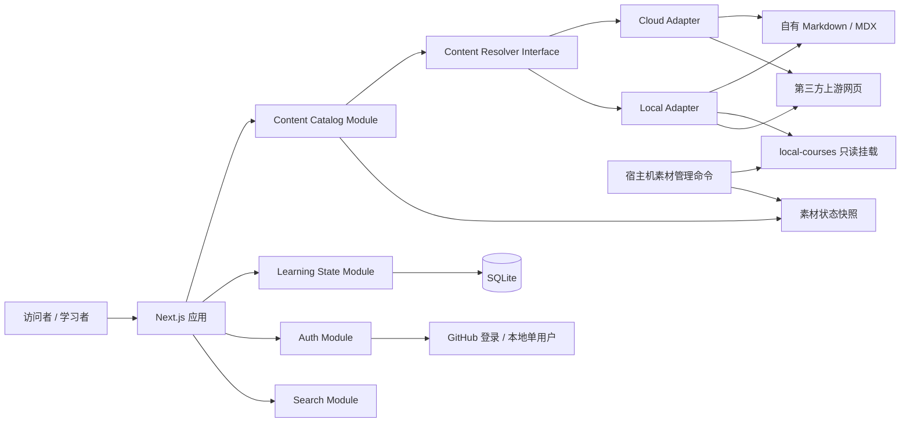

# Agent Learning Hub 产品与技术方案

**状态**：首版实施基线；已与 `code/` 当前实现同步
**最近同步**：2026-08-24
**产品名称**：Agent Learning Hub / Agent 学习中心

## 1. 方案摘要

Agent Learning Hub 是一个以实践产出为主线的 Agent 工程学习平台。平台公开提供九阶段学习路线、课程导览、自有文章和项目阶梯；用户通过 GitHub 登录后，可以跨设备同步学习进度、收藏、私人笔记和阶段成果。

平台使用同一套应用支持两种运行模式：

- **云端模式**：不携带本地第三方素材库。自有 Markdown/MDX 在站内阅读，第三方资料通过经过策展的导览页访问上游网页。
- **本地模式**：通过 Docker 将 `local-courses/` 只读挂载进应用，优先使用站内阅读器；本地文件不存在时回退到上游网页。

公开课程内容由 Git 管理，用户身份和学习状态由部署服务器上的 SQLite 管理。第三方资料保留作者、许可证和上游地址，不作为本项目原创内容重新发布。

## 2. 当前仓库基线

以下数字是 2026-08-08 的本地快照，后续应由脚本生成，不能继续手工维护：

- `learning-site/` 已实现线路图式学习界面、课程目录、九阶段路线、进度记录和 Markdown/MDX 阅读器。
- 当前内容数据包含 4 条学习轨道、9 个阶段、42 个课程条目、38 个阅读分组和 472 篇阅读章节。
- 路径审计检查了 548 条本地引用，全部命中；`AICoding/opencode/code/openchamber` 尚未进入课程清单。
- `local-courses/` 约 11 GB、约 17.9 万个可见文件，包含 57 个嵌套 Git 仓库。
- 57 个嵌套仓库都有 `origin` 和上游分支；其中 3 个仓库存在本地追踪改动，不能自动拉取。
- 主仓库只追踪了少量 `local-courses/` 文件，直接部署当前仓库会导致云端阅读器无法访问绝大多数本地章节。
- 根目录旧版网站额外包含阶段笔记和深浅主题，可作为迁移参考，但不继续独立演进。

现有参考文件：

- [`README.md`](../../README.md)
- [`local-courses/README.md`](../../local-courses/README.md)
- [`learning-site/data.js`](../../learning-site/data.js)
- [`learning-site/app.js`](../../learning-site/app.js)
- [`learning-site/direction-approved.md`](../../learning-site/direction-approved.md)

当前实现和可再生成快照位于 `code/`：公开目录为
[`code/content/`](../../code/content/)，维护脚本为
[`code/scripts/`](../../code/scripts/)，审计报告为
[`code/reports/`](../../code/reports/)。历史统计只以生成的
[基线报告](../../code/reports/baseline/baseline.md) 为准。

### 2.1 当前实现与验收边界（2026-08-24）

本方案描述架构和边界，任务完成状态以 [`tasks.md`](./tasks.md) 的系统复核为准。当前复核确认：

- `check:cloud` 与 `check:local` 均通过，原生生产构建服务的 Local/Cloud HTTP E2E、学习状态、鉴权、导出和删号链路通过；Local 浏览器走查 54 captures / 0 findings，功能回归 23/23。
- `audit:boundaries` 通过；`materials check`、`audit`、`reindex` 可运行。`materials drift` 是独立的目录策展检查，当前因 4 个未收录仓库非零退出，不应并入 `check` 或被解释成应用故障。
- T8.8 仍未完成：课程条目和旧站单章条目之间存在重复正文声明，必须先确定唯一目录拥有者，再继续章节策展。不要把当前素材仓库动态数量写进方案正文。
- 真实 DNS/TLS/OAuth、固定发布镜像的拉取与回滚、受保护分支 Actions、异地备份/调度/告警和生产日志复核仍属于外部运维验收；本地测试不能代替这些证据。

本机端口事实由 `code/scripts/docker-deploy.sh` 和 `mode-switch.sh` 维护：原生开发服务与 Local Docker 默认使用 `3001`，Cloud Docker 默认使用 `3002`，Release/生产实例使用回环地址 `3000`。`3100` 只用于隔离端到端测试示例，不是日常预览端口。

## 3. 产品定位

### 3.1 目标用户

- 公开访问者可以浏览路线、课程导览、自有正文和项目建议。
- 任意 GitHub 用户可以登录并保存自己的学习状态。
- 仓库维护者拥有管理员身份，负责内容审核、素材状态和系统健康。
- 本地模式默认是仅限本机访问的单用户学习工作台，不要求联网登录。

### 3.2 核心价值

平台不是第三方资料镜像，也不是随机链接目录。它要完成三个目标：

1. 把 Agent 工程知识组织成一条可以执行的九阶段路线。
2. 让每个阶段产生代码、演示或总结等真实成果。
3. 在云端便捷访问上游资料，同时保留本地深度阅读大规模素材库的能力。

### 3.3 明确不做

首版不包括：

- AI 导师或自动问答。
- 评论社区、动态流和排行榜。
- 证书、积分、连续打卡奖励。
- 付费系统。
- 在线内容 CMS。
- 自动评分或 AI 审核阶段成果。
- 在云端抓取、代理或重新托管第三方正文。

## 4. 信息架构

### 4.1 九阶段主线

九阶段学习路线继续作为产品主结构，四条轨道只承担分类和筛选：

- Learning：系统课程与教材。
- AICoding：Coding Agent 与 Harness。
- Agentic：框架、记忆与理论。
- Application：落地应用与工具。

每个阶段统一包含：

- 学习目标。
- 维护者讲解。
- 精选学习资料。
- 实践任务。
- 明确的验收产物。
- 用户私人笔记。
- 完成状态。

普通任务可以逐项勾选，但阶段必须关联一个成果记录后才算完成。成果可以是 GitHub 仓库、演示链接或学习总结，由用户自证。

### 4.2 页面结构

公开页面：

- 首页。
- 九阶段学习路线。
- 课程目录与筛选。
- 课程导览页。
- 自有内容阅读器。
- 搜索结果。
- 项目阶梯。
- 关于、内容政策与贡献指南。

登录后页面：

- 我的学习面板。
- 继续阅读。
- 进度与收藏。
- 私人 Markdown 笔记。
- 阶段成果。
- 个人数据导出。
- 删除账户。

管理员页面：

- 内容审计结果。
- 上游素材新鲜度。
- 失效链接。
- 数据库、备份与部署健康。
- 不关联个人身份的访问汇总。

管理员不得浏览其他用户的私人笔记正文。管理员健康页要求 `mode === "cloud"` 且 GitHub ID 在 `ADMIN_GITHUB_IDS` 中；Local Mode 的固定单用户不满足该条件，因此 `/admin` 在本地模式返回 404。本地运维改用 `/api/health` 与 `code/reports/` 下的审计产物。

### 4.3 展示层约定

目录规模决定了展示层的两条硬约束：

- **分页**：课程目录与搜索结果按每页 24 条分页（`app/components/pagination.tsx`），且只对当前页调用 Content Resolver。目录有 500+ 条，全量解析会在 Local Mode 逐条命中文件系统，页面高度也会失控。分页写进 URL 查询参数。
- **标签映射**：`accessPolicy`、`publicationRights`、`licenseStatus`、搜索 `kind` 和阶段成果 `kind` 都是 schema 枚举，必须映射成中文再渲染——目录卡片走 `app/components/content-card.tsx` 的标签函数，搜索结果与学习面板各有自己的映射表（`searchKindLabel`、`outcomeKindLabels`）。

旧站导入的遗留形态同样在展示层收敛，而不是回写数据：缺失字段的字面量 `Unknown` 显示为“作者待补 / 许可证待确认”，`legacy-reading` 等内部标签不出现在卡片上，与 summary 完全重复的标签不重复渲染。数据层保留原样，以便后续人工复核时能看出哪些条目还没有元数据。同一份 `displayTags()` 也决定 `/courses` 标签下拉的可选值——记账标签既然不该出现在卡片上，就更不该成为可分享的筛选状态。

**查询参数校验**：轨道、阶段、访问方式和标签都先对照目录中真实存在的值检查，不匹配即视为未传，并且不参与分页链接。这条约束有两个来由：一是未校验的值会被当成筛选条件执行，把当时 515 条的目录悄悄变成空网格，读者无从判断是没有内容还是链接坏了；二是曾经把原始参数直接印在结果计数旁边，等于把任意查询串回显进页面。目录数量由当前报告生成。

响应式方面，主导航在 860px 以下让位给可横向滚动的 `.compact-nav`；替代导航必须留在 DOM 中，不允许出现没有站内导航的视口。横向滚动的容器（`.compact-nav` 与窄屏下的路线图）都隐藏了滚动条，因此必须在右边缘做淡出——没有淡出时，被视口裁掉的半个汉字读起来像渲染错误而不是“可以滑动”。

顶部导航的最后一项随运行模式取值：Cloud Mode 是“登录”，Local Mode 是“账户”。Local Mode 由 `ensureLocalUser()` 自动签入固定单用户，`/login` 页面本身就写着“你不需要登录”，导航再提示登录只会自相矛盾。

**个人状态在公开页面上的取用方式**：路线页和阶段页都要显示私人进度，但一个页面只允许对 `/api/state` 取一次快照。`app/components/stage-progress.tsx` 的 `StageProgressProvider` 是唯一的取数点，它包住服务端渲染的子树，`StageProgressBadge` 与 `StageTaskChecklist` 从 context 读——路线页一次渲染九行，逐行请求同一份快照是明确的回归项。未认证时这些控件整块不渲染并留一句说明，而不是渲染出点了不会保存的控件；快照到达前也不渲染 `0/3`，否则签出状态的读者会先看到一个凭空出现又消失的进度。

进度与完成是两件事：徽标最多显示“动作已做完 · 待交成果”，只有 `stage_outcomes` 里真有记录才显示“已交成果”。STATE-005 把阶段完成的判定权留给用户主动提交的成果，界面不得用勾选数替它下结论。

## 5. 总体架构



架构的关键 seam 是 `Content Resolver Interface`。云端和本地各有一个 adapter，调用者不需要理解文件挂载、上游链接、回退策略和安全校验。

## 6. 核心模块

### 6.1 Content Catalog Module

职责：读取、校验和查询所有公开课程、阶段和学习资料。

建议 Interface：

```ts
listItems(query): LearningItem[]
getItem(id): LearningItem
getStage(id): Stage
```

每个学习资料至少记录：

```yaml
id:
title:
track:
stageIds:
summary:
learningGoals:
sourceUrl:
localPath:
accessPolicy:
author:
license:
tags:
lastReviewedAt:
```

约束：

- `sourceUrl` 对第三方资料必填。
- `localPath` 可选，只用于本地模式。
- 缺少来源或许可证状态的第三方条目不能被标记为可重新发布。
- 数量统计必须从目录生成，不写入 README 常量。

当前实现以 `code/modules/catalog/content-schema.ts` 中的 Zod schema 为
可执行契约；`code/content/` 下的 `catalog/`、`stages/`、`courses/` 和
`articles/` 文件在读取时先逐文件校验，再校验跨记录引用。调用方只能通过
Catalog API 获取内容，不能从 SQLite 或 `local-courses/` 反推公开目录。

Catalog 同时承载四条 Track、Stage、Stage Task、Project Outcome 和 Learning
Item：Stage 按顺序引用任务和成果；Stage Task 必须属于一个 Stage 并写明验收条件；
Project Outcome 可以暂时没有明确阶段映射；Learning Item 可暂时没有阶段，但其 ID
必须是全局唯一的小写 kebab-case。`listItems()` 按 `stageId`、`track`、全部标签和
`accessPolicy` 筛选，并按稳定 ID 排序；不存在的 `getItem()`/`getStage()` 返回
`undefined`。

发布归属也由 schema 强制表达：`project-owned` 或
`republication-authorized` 只有在许可证已知时才可使用 `owned`；`third-party`
必须有上游 URL，不能使用 `owned`；`upstream-only` 没有 `localPath`；
`local-preferred` 同时需要相对、POSIX 风格且无路径穿越的本地路径与上游回退 URL；
`unavailable` 不得伪造可访问地址。schema 只验证元数据，实际文件是否可读仍由
Content Resolver 在当前运行模式下判断。

`npm run convert:legacy --prefix code` 可重复把 `learning-site/data.js` 转为
`code/content/` 的结构化清单、保留 `legacyImport.raw` 和无损源快照，并写入
`code/reports/legacy-conversion/`。转换器不会猜测第三方归属：未知作者/许可证以
`Unknown` 显式保留，缺少上游地址保留为 `null`，所有待补项目写入报告。

该转换器是迁移期工具，已随目录改为人手维护而废弃，仅作溯源保留，输出固定写
`legacy-import.json`，不再产生现役目录；见
[ADR 0006](../adr/0006-catalog-is-hand-maintained.md)。

### 6.2 Content Resolver Module

建议 Interface：

```ts
resolve(item, runtime): ResolvedContent
```

返回类型限制为：

- `internal-mdx`
- `local-document`
- `external-link`
- `unavailable`

Cloud Adapter：

- 自有 MDX 返回站内阅读地址。
- 第三方资料返回上游网页地址。
- 不读取或假设存在 `local-courses/`。

Local Adapter：

- 白名单文件存在时返回站内阅读地址。
- 文件不存在时回退上游网页。
- 路径必须解析在只读挂载根目录内，禁止路径穿越。

### 6.3 Learning State Module

职责：管理用户个人学习状态，包括：

- 未开始、进行中、已完成。
- 最近阅读位置。
- 阶段任务。
- 收藏。
- 私人 Markdown 笔记。
- 阶段成果记录。
- 数据导出与账户删除。

链接点击只能将外部资料标记为“已开始”。完成状态必须由用户手动确认，阅读位置不等于完成。

### 6.4 Auth Module

- 云端模式使用 GitHub 登录。
- 允许任意 GitHub 用户注册学习状态。
- 只申请身份识别所需的最低权限，不申请仓库写权限。
- 管理员通过稳定的 GitHub 用户 ID 白名单识别。
- 本地模式默认使用单用户身份，且服务只绑定 `127.0.0.1`。
- 本地服务主动开放到局域网或公网时必须启用登录。

### 6.5 Reader Module

保留现有阅读器的核心能力：

- Markdown、GFM 表格、代码块和图片。
- 目录、章节过滤、上下章。
- 阅读位置恢复。
- Markdown/MDX 的安全白名单渲染。

渲染策略（`modules/reader/markdown.ts`）：

第三方素材是为 GitHub 写的，正文里普遍混着排版 HTML——居中容器、shields 徽章、`<br>`、`<details>` 和表格。把这些标签整体转义会让 README 变成一屏尖括号，因此阅读器采用**允许通过 + 白名单收敛**，而不是全量转义：

- **标签白名单**：保留 `a`、`img`、`div`、`span`、`table` 系列、`details`/`summary`、标题、列表等展示性标签。
- **整棵丢弃**：`script`、`style`、`iframe`、`object`、`embed`、表单控件等连同内容一起移除。
- **未知标签**：丢标记、留文本，不让未识别的元素影响版式。
- **属性白名单**：逐标签限定；`on*` 事件属性一律丢弃；`href` 只接受 `http(s)`/`mailto`/站内路径/锚点；`src` 只接受远程 `http(s)` 或调用方解析出的本地允许路径。
- **未闭合标签**：结束时补齐，避免上游一个笔误破坏整页布局。
- **图片加载属性**：所有 ``（Markdown 语法与原始 HTML 两条路径）统一补 `loading="lazy"`、`decoding="async"` 和 `referrerpolicy="no-referrer"`。徽章与头像常以绝对地址写死，消毒后仍是绝对地址，请求依然从读者浏览器发往上游主机；`no-referrer` 至少不把正在读哪一页告诉对方，惰性加载则让一份上万像素高的 README 不必先拉完几十张图。彻底禁止远程图片会改变第三方素材的呈现结果，属于内容政策变更，需要单独的 ADR。
- **字符实体**：`&emsp;` 等有效实体原样输出，不做二次转义（中文 README 依赖它做段首缩进）。
- **扩展语法**：GFM 管道表格（外层 `overflow-x` 容器）、`---` 分隔线、缩进嵌套列表、`- [ ]` 任务项。

链接与图片都先经 `resolveDocumentRelativePath()` 按**当前文档所在目录**解析，再对照课程条目声明的路径（`localPath` 与 `references[].localPath`）：

- 命中允许章节的链接改写为 `/read/<id>?chapter=<path>`；未命中的降级为纯文本。
- 命中声明路径的图片改写为 `/api/local-image`；未命中的整个 `` 丢弃。
- 解析结果若走出素材根（`../` 过多）一律拒绝。

这一步是必需的：素材是按仓库检出写的，正文里的 `./docs/chapter1/x.md` 相对的是文件而不是阅读器路由，原样输出会被浏览器解析成 `/read/docs/chapter1/x.md` 并必然 404。该规则与 `/api/local-image` 自身的 allowlist 是同一份，两处必须一起改。

章节集合同时驱动**上下章导航**：`listLocalChapters()` 的顺序即翻页顺序，首章无上一章、末章无下一章。

> 历史内容缺口基线（2026-08-11，不是代码缺陷）：512 个本地条目合计只声明了 547 个 markdown 章节，而这些目录下有约 17,030 个 md 文件，因此多数课程站内只能读到 1—2 章。全量声明并不可取——其中大量是文档站、i18n 和示例噪音，会污染阅读器与搜索索引。补齐属于逐课程的内容策展工作，见 tasks.md T8.8；当前重复声明的归属问题仍须先决策。

安全规则：

- 禁止脚本、事件属性、任意 iframe 和可执行 MDX JavaScript。
- 只允许经过定义的展示组件与上述标签白名单。
- 无法安全渲染的内容提供源码视图和上游网页链接。
- 云端不提供任意 URL 的服务器端抓取或代理。
- 扩大标签、属性或图片 allowlist 属于安全边界变更，需先更新 ADR 与规格。

### 6.6 Search Module

搜索只覆盖策展内容：

- 云端索引课程元数据、自有 MDX、阶段和项目内容。
- 本地模式额外索引课程清单中允许阅读的本地章节。
- 不扫描整个 `local-courses/`。
- 搜索结果明确标记站内、上游网页或本地可读。
- 本地素材更新后重建或增量更新索引。

**一个目标一条结果。** 历史导入把每个上游章节文件都升格成了独立课程条目（当时 514 条中有 472 条是 `reading-chapter`），这些条目的唯一 reference 与条目同名、指向同一个文件。早期的索引对每个条目既产出 `item` 文档又产出 `local-chapter` 文档，于是本地模式下每条结果都成对出现；这些数字是缺陷修复前的历史快照，不是当前目录统计。

`buildRuntimeSearchIndex()` 因此按章节数分流：**单章条目**把章节正文并进条目自身的检索文本，不再单独产出章节文档——这同时补上了一个空缺，因为在此之前只有 `owned` 条目的正文进入索引，本地条目仅靠元数据可搜；**多章条目**（如 Hello-Agents 的 README + 前言）保留逐章文档，它们标题不同、目标不同，读者需要直接跳到某一章。给本地素材增加索引维度时必须维持这个不变量。

结果行的定位信息取自 `SearchDocument.summary`：条目用自身摘要、阶段用阶段摘要、章节用所属条目标题。此前历史导入条目中只有少数挂了阶段，整页结果都塌成同一句“未关联路线阶段”。当前数量由目录和搜索索引命令生成，不在方案中固化。

### 6.7 Material Freshness Module

网站进程只读取素材状态，不直接修改嵌套仓库；仓库数量和 freshness 由报告动态生成。

宿主机提供独立命令：

```text
materials check
materials update <course-id>
materials audit
materials reindex
```

更新流程：

1. 获取上游状态，但不修改工作区。
2. 比较本地和上游提交。
3. 标记最新、落后、分叉、本地修改或检查失败。
4. 用户选择单个仓库后，仅允许 fast-forward 更新。
5. 更新完成后执行路径审计并重建搜索索引。

当前存在本地追踪改动的仓库：

- `AICoding/claude/document/learn-claude-code`
- `AICoding/openclaw/openclaw-code`
- `AICoding/opencode/plugins/opencode-wakatime`

这些仓库必须拒绝自动更新，直到本地修改被明确处理。

## 7. 内容维护与归属

### 7.1 Git 管内容，数据库管状态

- 课程正文、路线、项目任务和公开文章位于 `code/content/` 的 Git 管理文件。
- frontmatter 记录阶段、轨道、来源、作者、许可证和更新时间。
- 内容通过 Git 提交、审查和发布。
- SQLite 只保存身份、会话和用户个人学习状态。
- 用户笔记默认私有，可以导出为 Markdown。
- 公开学习总结必须经过整理并提交到仓库，不允许直接公开私人笔记。

交付边界由 [`docs/content-boundaries.json`](../content-boundaries.json) 机器校验：

| 区域                                     | Git 与运行时归属                                                        |
| ---------------------------------------- | ----------------------------------------------------------------------- |
| `code/`（含 `code/content/`）            | 版本化应用源和可公开的策展内容，可进入运行镜像                          |
| `docs/`、`learning-site/`                | 版本化文档和迁移基线，不进入运行镜像                                    |
| `local-courses/`                         | 第三方 Local Material；仅允许跟踪其 `README.md`，仅 Local Mode 只读挂载 |
| `code/.data/`、`backups/`、`.env*`、密钥 | 运行状态或秘密，不进入 Git、构建上下文或镜像                            |
| `code/reports/`                          | 可再生成审计证据，不进入运行镜像                                        |

`npm run audit:boundaries --prefix code` 在 CI 上传 artifact 前检查 `.gitignore`、
`.dockerignore`、CI artifact 配置和 Git 索引；缺少规定忽略项、跟踪未批准的
Local Material 或可能上传受保护数据时必须失败。云端构建上下文还必须排除
`local-courses/`、状态、备份、秘密、报告和旧站；Local Mode 只能借由 Compose
的只读挂载获得素材。

### 7.2 第三方内容策略

- `local-courses/` 是本地素材库，不是本项目原创内容目录。
- 云端不打包、不重新托管、不代理第三方正文。
- 云端课程页提供维护者摘要、学习目标、来源和上游链接。
- 只有许可证明确且确实需要站内发布的内容，才可进入单独白名单。
- 所有第三方条目保留原作者、上游地址和许可证信息。
- [`docs/content-boundaries.json`](../content-boundaries.json) 是目录归属的机器可读事实源；`npm run audit:boundaries --prefix code` 核对 `.gitignore`、`.dockerignore` 与 CI artifact 规则。

### 7.3 社区贡献

- 用户通过 GitHub Issue 或 Pull Request 推荐和修正内容。
- 网站内不提供课程投稿表单。
- 公开内容必须经过维护者审核后进入 Git 历史。
- 贡献者和上游作者信息必须保留。

## 8. 数据模型

公开课程不存入 SQLite。建议用户数据表如下：

| 表                                | 用途                         |
| --------------------------------- | ---------------------------- |
| `users` / `accounts` / `sessions` | GitHub 身份和会话            |
| `item_progress`                   | 学习资料状态与阅读位置       |
| `stage_task_progress`             | 阶段任务勾选                 |
| `notes`                           | 私人 Markdown 笔记           |
| `bookmarks`                       | 收藏                         |
| `stage_outcomes`                  | 阶段成果链接、总结和完成时间 |
| `operational_metrics`             | 不关联身份的按时间桶运营汇总 |

数据约束：

- 所有个人记录按用户隔离。
- 笔记和请求频率设合理上限。
- 用户可以导出自己的进度、收藏、成果和笔记。
- 删除账户必须级联删除相关个人数据。
- `operational_metrics` 不得存储用户 ID、IP、Cookie、查询参数、笔记正文、路径参数或秘密；
  仅保存固定枚举的事件、范围、结果、计数和最后发生时间，并在有限保留期后清理。

## 9. 双运行模式

### 9.1 云端模式

- `DEPLOYMENT_MODE=cloud`
- GitHub 登录。
- SQLite 位于持久化数据卷。
- 不挂载 `local-courses/`。
- 自有内容站内阅读，第三方资料打开上游网页。
- 通过反向代理提供 HTTPS。

### 9.2 本地模式

- `DEPLOYMENT_MODE=local`
- 默认单用户免登录。
- 只绑定 `127.0.0.1`。
- `local-courses/` 以只读方式挂载。
- SQLite 位于本机数据目录。
- 优先本地阅读，缺失时回退上游网页。
- 可以离线使用已经存在的本地资料。

两种模式使用同一镜像、同一课程 ID、同一内容 schema 和同一学习状态模型。

### 9.3 开发服务的回环约束

本地模式的免登录身份由 `assertLocalAuthBinding` 强制：绑定到非回环地址时进程直接拒绝启动。这条约束向上传导到开发服务本身——`next dev` 会按 `allowedDevOrigins` 校验静态资源请求的来源，未列入的来源返回 403，客户端 bundle 加载失败，页面停在服务端渲染的初始状态（表现为“我的学习”永远显示加载中、勾选与收藏无响应）。

因此 `next.config.ts` 必须把运行手册给出的全部回环写法（`127.0.0.1`、`localhost`、`[::1]`）列入 `allowedDevOrigins`。`local-preview.sh` 打印的预览地址是 `http://127.0.0.1:<port>`，两者必须保持一致。生产的 `next start` 不做这项校验，所以这类缺陷只会在开发与本地预览中出现——`npm run check` 也发现不了，需要靠 UI 走查覆盖（见 NFR-009、NFR-010）。

## 10. 技术选择

- Next.js App Router + TypeScript。
- Markdown/MDX 内容编译和经过白名单的渲染插件。
- Better Auth + GitHub 登录。
- SQLite + Node.js 稳定驱动。
- Docker 多阶段构建。
- Docker Compose 提供基础、云端、本地、发布和生产运维覆盖配置。
- GitHub Actions 执行校验、测试、镜像构建和版本发布。
- 云端部署固定版本标签，不直接跟随 `latest`。

运行 SQLite WAL 模式前，必须确认所使用的 SQLite 版本已经包含 2026 年 WAL-reset 问题修复。SQLite 文件、WAL 文件和共享内存文件必须位于同一台主机的持久化磁盘上。

## 11. 当前目录结构

```text
code/
  app/
  lib/
  content/
    articles/
    catalog/
    courses/
    stages/
    schemas/
  docker/
    Dockerfile
    docker-compose.yml
    docker-compose.cloud.yml
    docker-compose.local.yml
    docker-compose.release.yml
    docker-compose.production.yml
  modules/
    admin/
    auth/
    catalog/
    content-resolver/
    learning-state/
    observability/
    reader/
    runtime/
    search/
    freshness/
  reports/
  scripts/
    docker-deploy.sh
    local-preview.sh
    mode-switch.sh
    image-release.sh
    lighthouse-deploy.sh
    audit-content.ts
    materials.ts
    database.ts
    audit-content-boundaries.mjs
    baseline-report.mjs
    convert-legacy-content.mjs
    ui-review.mjs
    functional-regression.mjs
  tests/
    e2e/
      browser-acceptance.mjs
      home-page-http-smoke.mjs
      public-pages-http-smoke.mjs
      health-http-smoke.mjs
      learning-state-http.mjs
learning-site/
  ...迁移期间保持可运行
local-courses/
  ...本地素材库，不进入云端镜像
```

`code/` 是新前后端一体化工程的唯一代码目录。现有 `learning-site/` 和根 `index.html` 只作为迁移与功能对等基线保留；在 Phase 8 切换完成前不移动到 `code/`，也不继续作为独立产品演进。

## 12. 视觉与移动端

- 保留 `learning-site/` 已确认的交通线路图骨架和暖色出版物设计。
- 延续轨道色、阶段站点、课程网格和衬线阅读器。
- 增加登录状态、继续学习、部署模式和素材状态标识。
- 手机端支持完整的学习、搜索、阅读、笔记和进度流程。
- 手机端线路图改为可折叠阶段导航。
- 手机端阅读器使用目录抽屉和正文布局。
- 素材更新与部署管理只面向桌面或命令行。

## 13. 运行、隐私、备份与监控

### 13.1 用户数据

- 只保存 GitHub 身份所需的最少字段。
- 不将 GitHub Token 用于身份登录之外的用途。
- 用户可以导出个人数据。
- 用户可以彻底删除账户及相关数据。
- 不接入广告型或跨站追踪。

### 13.2 SQLite 备份与恢复

- `code/modules/learning-state/database.ts` 创建 `schema_migrations`，以事务应用每个 schema version；失败事务由 SQLite 回滚，再次启动会重试同一版本。每个连接启用外键，个人表从 `users` 级联删除。
- WAL 仅在 SQLite `3.51.3` 或以上启用。数据库、`-wal` 和 `-shm` 是一个状态单元，不得在运行中只复制主文件。
- `code/scripts/database.ts` 使用 SQLite backup API 创建一致性快照，AES-256-GCM 加密、写入 SHA-256 manifest，并保留 7 个 daily 与 3 个 weekly 槽位；异地复制、调度和告警仍由部署方负责。
- 配置 `BACKUP_OUTPUT_DIR` 后，管理员健康摘要会核对保留备份的字节数与 SHA-256 manifest，并只返回数量、时间、大小和健康状态；不会返回备份文件名、绝对路径或校验和值。
- 备份示例：

  ```bash
  STATE_DATABASE_PATH=/data/state/learning-state.sqlite \
  BACKUP_OUTPUT_DIR=/secure/backups/agent-learning-hub \
  BACKUP_PASSPHRASE='provided-by-secret-manager' \
  npm run db:backup --prefix code
  ```

- 恢复必须写入新的空目标，并显式确认：

  ```bash
  BACKUP_PASSPHRASE='provided-by-secret-manager' \
  npm run db:restore --prefix code -- \
    --input /secure/backups/agent-learning-hub/<backup>.sqlite.enc \
    --target /data/restore/learning-state.sqlite \
    --yes
  ```

恢复命令会拒绝覆盖已有目标，解密后先执行 SQLite `quick_check`，再原子安装数据库。
生产恢复时先停止写入，将完整状态单元恢复到可写目录，让应用重新打开数据库并执行
迁移和外键检查。调度、异地存储和告警仍属于部署方工作。

- `code/scripts/restore-drill.ts`（`npm run drill:restore`）把恢复演练固定成一条自带判定的命令：备份 → 在从未存在过数据库的目录里恢复 → `integrity_check`、schema 与逐表行数比对 → 用应用自己的 opener 重开。它同时验证恢复路径**会失败**：错误口令、被篡改一个字节的密文、覆盖已有目标三者必须全部被拒绝。命令在开发机用合成 fixture 跑，在云主机由 `lighthouse-deploy.sh restore-drill` 对真实生产数据跑，两边是同一段代码。
- `--source` 通过 SQLite 在线备份 API 取快照，不用文件拷贝：live 库的已提交页可能仍在 `-wal` 里。这条约束使得把演练指向生产卷是安全的。
- 只读挂载状态卷时，`-shm` 必须存在。实测确认 `-wal` 非空而 `-shm` 缺失时只读打开直接 `SQLITE_CANTOPEN`，且报错不提任何文件名——这是"不得手工搬运库文件"这条约束的具体后果。

### 13.3 监控

记录：

- 请求错误和登录失败。
- 数据库健康。
- 备份和恢复验证结果。
- 内容审计和素材更新结果。
- 不关联个人身份的页面访问汇总。

应用仅写入固定枚举的 `Operational Metric` 聚合记录，并把同样的安全字段输出为结构化
日志；绝不记录请求头、Cookie、IP、查询参数、路径参数、错误原文、私人笔记或秘密。
当前实现以 SQLite schema version 2 按小时聚合 `page_view`、健康检查、状态/API 错误、
GitHub 登录失败，以及备份、恢复、内容审计和素材更新的命令级结果，并在写入时清理 30 天前
的桶。维护命令通过 `OPERATIONAL_METRICS_DATABASE_PATH` 或既有 `STATE_DATABASE_PATH` 写入
聚合；未配置数据库时仍输出同样的固定枚举结构化日志，不会创建额外状态库。
管理员健康摘要只显示聚合计数和由失败阈值计算的告警规则结果。实际日志收集、异地留存
和告警通知由部署方接入其监控平台，不能由站点自行向外部端点发送数据。

### 13.4 部署、容器与数据库运维

`code/docker/Dockerfile` 是 Cloud/Local 共用的多阶段镜像定义；构建上下文
始终是仓库根目录，因此 `.dockerignore` 能排除 Local Material、SQLite、备份、
秘密和 `code/reports/`。`code/docker/` 中的 Compose 基础文件与 Cloud、Local、
Release 覆盖文件共同定义运行模式；`docker-compose.production.yml` 仅由生产 Runbook
追加，用稳定命名卷保存 SQLite，并把主机加密备份目录只读暴露给管理员健康摘要。

从仓库根目录使用 `code/scripts/docker-deploy.sh`，而不是手工拼接旧根目录
Compose 文件：

```bash
code/scripts/docker-deploy.sh local up
code/scripts/docker-deploy.sh local verify
code/scripts/docker-deploy.sh local down
```

Local Mode 仅允许回环 `APP_BIND_HOST`，只读挂载 `local-courses/`，并保留命名
SQLite 卷。本机日常预览有两个委托入口：`code/scripts/local-preview.sh` 只绑定
回环地址启动 Local Mode 预览；`code/scripts/mode-switch.sh` 在本机 Docker 上切换
或并行运行 Local/Cloud 两种模式——两者使用各自的 Compose 项目、端口和 SQLite
卷，Cloud Compose 的 `${VAR:?}` 会让缺凭据时连 `down`/`ps` 都失败，因此只读与
停止路径注入显式假值，真正 `up` 必须显式传 `--preview-secrets` 才允许用一次性
假凭据，且只够渲染匿名页面。Cloud Mode 从根 `.env` 读取 Better Auth 与 GitHub
OAuth 配置；先运行 `cloud config` 静态校验合并配置且不输出展开后的秘密。GitHub
应用只注册 `${BETTER_AUTH_URL}/api/auth/callback/github`，只申请
`read:user`；旧的 `/api/auth/github/callback` 已停用。Release Mode 强制使用
`APP_IMAGE` 的固定版本或 digest，先 `pull` 再启动，绝不在生产主机重新构建源码。

生产实例先复制 `.env.example` 并由密钥管理系统注入 Better Auth 与 GitHub OAuth；
数据库备份口令保存在应用环境之外的 root-only 文件。不要把任何秘密写进 Compose、
命令历史或镜像。典型固定镜像发布入口为：

```bash
APP_IMAGE=ghcr.io/cr330326/agent-learning-hub:v0.1.0 \
code/scripts/docker-deploy.sh release up
```

本机构建并推送发布镜像的手工入口是 `code/scripts/image-release.sh`：默认交叉构建
`linux/amd64`（云主机是 x86，Apple Silicon 直接构建的 arm64 镜像跑不起来），拒绝
`latest`，推送前检查版本是否已存在，成功后打印可固定到 `APP_IMAGE` 或
`LIGHTHOUSE_IMAGE` 的 digest。带 SBOM 与签名溯源的正式发布仍走 `v*.*.*` tag 触发的
`.github/workflows/release.yml`；该脚本只覆盖 CI 到不了的镜像仓库或主机。

端口与运行位置以脚本为准：原生开发服务和 Local Docker 默认监听
`127.0.0.1:3001`，Cloud Docker 默认使用 `127.0.0.1:3002`，Release/生产 Compose
使用回环 `127.0.0.1:3000`。隔离 E2E 可以另行指定端口；不要把 E2E 端口当作日常预览
或生产端口。

`/api/health` 同时检查内容目录与 SQLite `quick_check`，不返回绝对路径、秘密或
用户状态。部署后除了健康接口，还应验证公开浏览、登录重定向、上游链接和管理员边界。

2026-08-09 的隔离 Docker 验证已使用 `agent-learning-hub:docs-verify` 完成：Local
Mode 的只读素材挂载、健康接口、公开路由、学习状态 HTTP 流程和重启后状态持久化均
通过；同一镜像的 Cloud Mode 仅挂载状态卷，且公开路由和云端搜索不暴露本地章节。
这不是已发布 GHCR 镜像、真实 OAuth 或生产回滚演练的替代证据。

升级前先完成加密备份，启动后等待 `/api/health` 并验证公开浏览、OAuth 重定向、
上游链接和管理员边界。镜像故障时仅切回前一不可变镜像；若数据库不兼容，停止写入，
将升级前快照恢复至干净状态卷，再启动上一镜像。TLS、DNS、反向代理、密钥管理、
异地备份复制、告警和正式恢复演练仍是部署方责任。

可执行步骤集中在 [`docs/deploy/`](../deploy/README.md)，三份文档对应三条运行路径：
[`local-manual.md`](../deploy/local-manual.md) 是本机运行本地服务的完整版（学习与
开发）；[`production-manual.md`](../deploy/production-manual.md) 从空白 Ubuntu 服务器
逐条手工执行；[`lighthouse-automation.md`](../deploy/lighthouse-automation.md) 通过
`code/scripts/lighthouse-deploy.sh` 在本机经 `ssh tencent-lighthouse` 执行预检、初始化、
秘密上传、升级前备份、固定镜像部署、验证与应用回滚。后两份做的是同一件事，逐节对应
关系在手工文档第 16 节。该脚本不会修改腾讯云防火墙、DNS、快照或异地存储，也不会把
应用回滚误当成数据库恢复。

### 13.5 脚本的运行位置

`code/scripts/` 的脚本按**执行位置**与**作用对象**分三类，两者不同：`image-release.sh`
与 `lighthouse-deploy.sh` 都在开发机执行，作用对象却是云端。

| 类别               | 脚本                                                                                                                                                        | 关键约束                                      |
| ------------------ | ----------------------------------------------------------------------------------------------------------------------------------------------------------- | --------------------------------------------- |
| 本机 → 本机        | `audit-content.ts`、`materials.ts`、`audit-content-boundaries.mjs`、`baseline-report.mjs`、`ui-review.mjs`、`functional-regression.mjs`、`restore-drill.ts` | 依赖素材库或浏览器的都不进 `npm run check`    |
| 本机 → 本机 Docker | `local-preview.sh`、`mode-switch.sh`、`docker-deploy.sh local\|cloud`                                                                                       | 只绑回环地址，各模式独立项目/端口/卷          |
| → 云端             | `image-release.sh`、`lighthouse-deploy.sh`（本机执行）；`docker-deploy.sh release`、`database.ts`、`restore-drill.ts`（云主机执行，由部署脚本打包上传）     | 只跑固定版本或 digest，绝不在生产主机构建源码 |

`materials.ts` 需要 `local-courses`，两个走查脚本需要浏览器和运行中的服务——三者都不
在生产主机运行，云端镜像本就不包含素材库。`restore-drill.ts` 是唯一横跨两类的脚本：
本机跑合成 fixture，云主机跑真实生产数据，两边是同一段代码。完整表格与依赖见
[`docs/deploy/README.md`](../deploy/README.md#脚本按运行位置分类)。

## 14. 文档职责

为避免多个派生文档互相漂移，文档按主题分工：

- 根 `README.md`：快速启动、目录导航、常用维护命令和安全边界。
- 根 `USER.md`：本地模式快速上手（跑起来、Docker 里切换模式、构建推送镜像）。
- 根 `GUIDE.md`：面向学习者和本机维护者的使用指南（模式差异、页面用法和走查命令）。
- 根 `AGENTS.md`：工程协作约束、现役目录、命令事实源和不可突破的安全边界。
- 根 `CONTEXT.md`：项目通用语言，避免把 Track、Stage、Curated Content 与 Local Material 混用。
- 本文：架构、内容模型、归属、Docker、备份、恢复和运维边界。
- `docs/deploy/`：从上述边界派生的执行 Runbook，三份对应三条运行路径（本机、云端手工、云端脚本）；不改变规格或任务状态。`README.md` 是入口，同时给出脚本运行位置分类。
- `tasks.md`：实施状态、可执行证据和需求到任务追踪。
- `spec.md`：产品需求和验收场景；`docs/adr/` 保存已接受的决策。
- `local-courses/README.md`：本地素材库的归属与维护约定。

原先分散的 `content-boundaries.md`、`content-model.md`、
`database-operations.md`、`deployment.md` 和 `requirements-traceability.md`
不再作为独立事实源；其中机器可读的 `content-boundaries.json` 仍保留。
每个需求 ID 的权威映射位于 `spec.md` 的需求定义和 `tasks.md` 相应任务的“规格”
与“实施证据”；修改需求或验收时必须同时更新这两处及相关测试。

## 15. 实施阶段

### Phase 1：新应用骨架与内容 schema

- 创建独立 Next.js 应用。
- 建立测试、格式检查和类型检查。
- 定义课程、阶段和资料 schema。
- 编写 `data.js` 到新内容清单的转换器。

退出条件：现有课程和阶段能够无损转换，清单校验通过。

### Phase 2：公开网站与视觉迁移

- 迁移线路图、路线、课程网格和项目阶梯。
- 建立课程导览页和自有内容阅读器。
- 完成桌面和移动端基础布局。

退出条件：匿名用户可以完成路线浏览、课程查找和自有内容阅读。

### Phase 3：云端内容模式

- 实现 Cloud Adapter。
- 第三方资料通过上游网页访问。
- 验证云端构建不包含或依赖 `local-courses/`。

退出条件：删除本地素材库后，云端构建和所有公开页面仍可正常运行。

### Phase 4：身份与学习状态

- GitHub 登录。
- SQLite schema 和迁移。
- 进度、收藏、笔记、阶段成果。
- 数据导出和删除账户。

退出条件：登录用户可以跨会话恢复完整学习状态。

### Phase 5：本地 Docker 与阅读器

- 实现 Local Adapter。
- 只读挂载 `local-courses/`。
- 本地单用户模式。
- 安全阅读器和上游回退。

退出条件：本地 Docker 能覆盖现有阅读器核心功能，且不要求 GitHub 登录。

### Phase 6：搜索与素材新鲜度

- 策展内容搜索。
- 本地白名单章节索引。
- 素材检查、选择性更新、路径审计和重新索引。
- 管理员素材状态页面。

退出条件：能够发现上游变化，且不会自动修改存在本地改动的仓库。

### Phase 7：交付与运维

- GitHub Actions 测试和镜像发布。
- 云端与本地 Compose 配置。
- 版本化部署和回滚。
- SQLite 异地备份和恢复演练。
- 隐私优先监控。

退出条件：能够从空服务器部署指定版本，并从备份恢复用户数据。

### Phase 8：功能对等与切换

- 新旧站功能对照。
- 双模式端到端测试。
- 移动端验收。
- 切换仓库入口。
- 将旧站保留为迁移归档。

## 16. 首版上线门槛

- 云端模式不存在对 `local-courses/` 的隐式依赖。
- 本地 Docker 支持阅读、搜索和进度保存。
- 云端和本地使用同一课程 ID 与内容模型。
- GitHub 登录、笔记、收藏、导出和删除账户通过集成测试。
- 路径回退、路径穿越保护和恶意 Markdown 测试通过。
- 手机端完成一次学习、阅读、笔记和成果流程。
- SQLite 备份能够在干净环境恢复。
- 新站覆盖旧站核心阅读器能力。

## 17. 相关决策记录

- [ADR-0001：使用同一代码库支持云端与本地模式](../adr/0001-one-codebase-two-runtime-modes.md)
- [ADR-0002：第三方素材只作为来源引用，不进入云端内容包](../adr/0002-third-party-materials-are-references.md)
- [ADR-0003：采用自托管 Next.js 与单节点 SQLite](../adr/0003-self-hosted-nextjs-and-sqlite.md)
- [ADR-0004：Better Auth 负责云端 GitHub 身份边界](../adr/0004-cloud-oauth-boundary.md)
- [ADR-0005：隐私优先的运营指标只保存匿名聚合](../adr/0005-privacy-first-operational-metrics.md)

## 18. 下一步

当前实现已经覆盖 Phase 0—6，并完成了 Phase 7/8 中的本地质量、双模式应用级验收、恢复演练工具、内容边界和大部分功能对等证据。T8.8 的目录归属/章节策展仍未完成；下一步以 `tasks.md` 中仍未勾选的交付工作为准：受保护分支 CI、已发布镜像拉取与回滚、空服务器 HTTPS 部署、异地备份与调度、生产日志/告警、安全隐私发布审查，以及最终仓库入口切换。现有 `learning-site/` 在这些门槛完成前保持为只读迁移基线。

实施时使用以下拆解文档：

- [产品规格与验收标准](./spec.md)
- [分阶段实施任务清单](./tasks.md)
